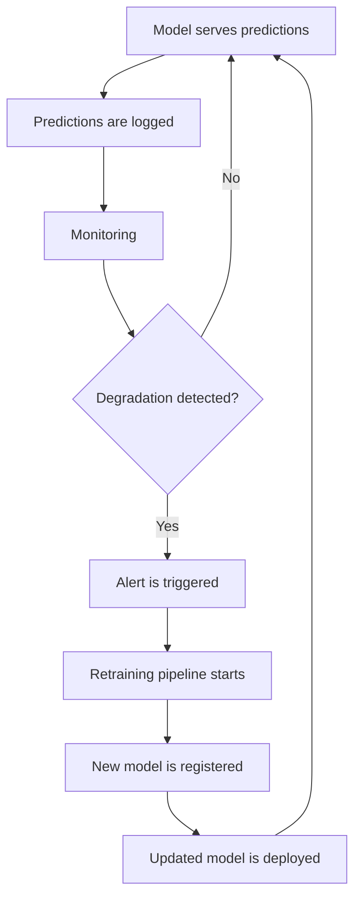
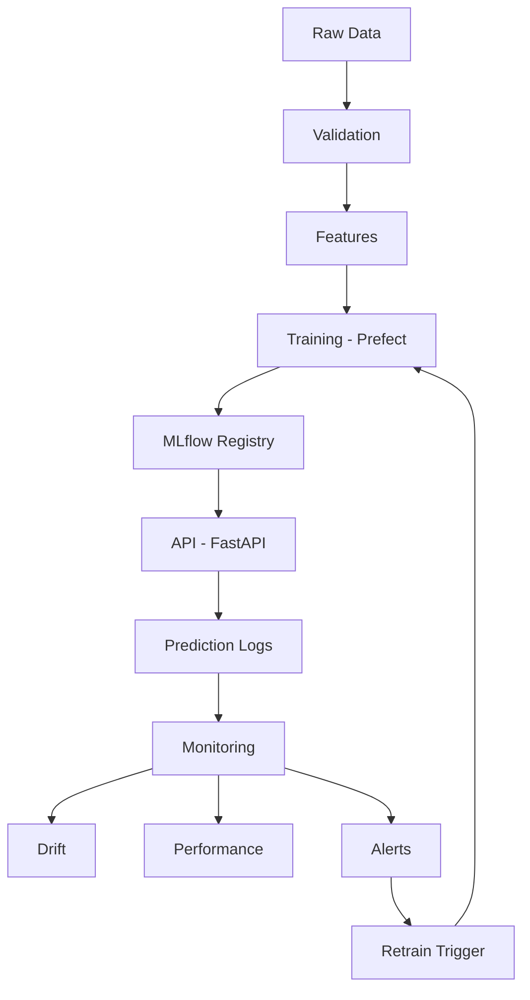
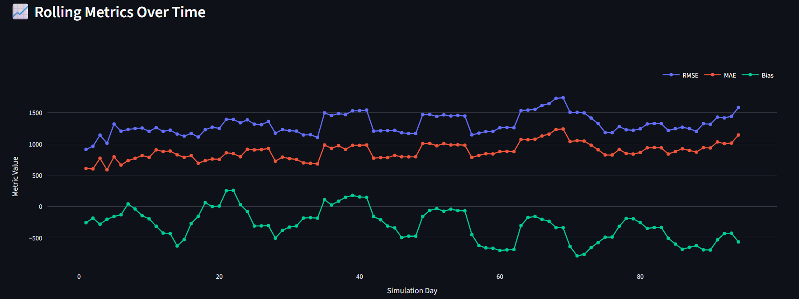
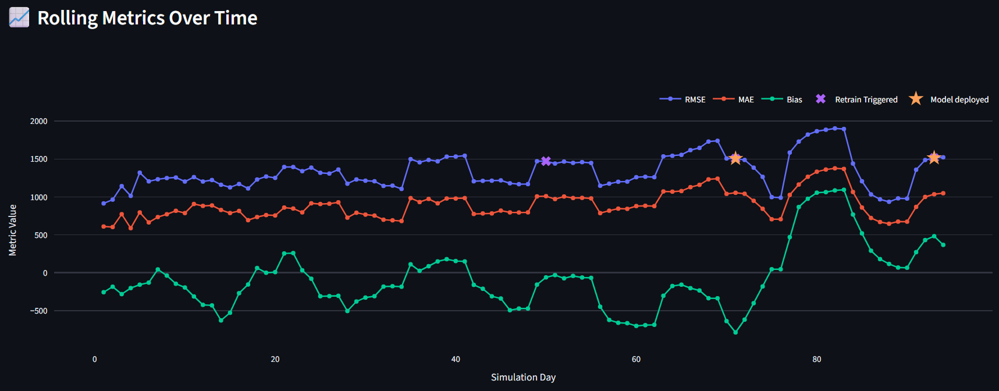

# 🚀 MLOps Blueprint — Turn your ML models into reliable production systems

> Most ML models don’t fail at training — they fail in production.  
> I help teams detect, monitor and continuously improve ML models in production before they cost you money.

---

## 🧠 The Problem (for real teams)

This system is built for teams that:

- already have ML models in production  
- rely on predictions for business decisions (forecasting, pricing, etc.)  
- don’t fully trust their model outputs  
- retrain models manually — or not at all  

🚨 **Reality:**

Models degrade silently.

- Data changes → predictions become wrong  
- No monitoring → no one notices  
- No alerts → problems stay hidden  
- No retraining → performance keeps dropping  

👉 By the time you react, your model is already costing you money.

---

## 💸 What this costs you

When ML systems are not monitored:

- 📉 Forecast errors increase → bad inventory decisions  
- 💰 Pricing models drift → margin loss  
- 🛒 Recommendations degrade → lower conversion  

👉 This is not a technical issue — it's a business risk.

---

## 🎯 What I do

I turn fragile ML models into **reliable production systems**.

Instead of static models, I build systems that:

- detect when performance drops  
- alert before it becomes critical  
- retrain models automatically  

👉 Result: your model becomes a controlled, continuously improving system

---

## 🎬 How it works (end-to-end)

1. **Model runs in production**  
   → Predictions are served via API and logged  

2. **Data starts drifting**  
   → Monitoring detects distribution changes  

3. **Performance degrades**  
   → Alert is triggered automatically  

4. **System reacts**  
   → Retraining pipeline is executed  

5. **New model is deployed**  
   → Performance is improved or stabilized  

👉 Result: a **self-healing ML system**

---

## 🔄 Self-Healing ML Loop



---

## 🏗️ What’s inside

This blueprint includes everything needed for production ML:

### 🔌 Serving & APIs
- FastAPI prediction service  
- Structured inference logging  

### 🔁 Pipelines & Orchestration
- Training & retraining pipelines (Prefect)  
- Trigger-based retraining  

### 📊 Monitoring & Observability
- Data drift detection  
- Feature drift tracking  
- Performance monitoring  
- Alerting system  

### 🧠 Model Management
- MLflow tracking & registry  
- Model versioning  

### 🗂️ Data & Reproducibility
- Dataset versioning  
- Validation pipelines  
- Reproducible training runs  

### ⚙️ Infrastructure
- Dockerized services  
- CI/CD pipeline with automated build, security scan, and deployment (GitHub Actions)
- Cloud deployment (GCP, Terraform)  

---

## 🗺️ Architecture Overview



---

## 📊 What this demonstrates

This project simulates real-world ML failure scenarios:

- models degrade under changing data  
- monitoring detects issues early  
- retraining is triggered automatically  
- only better models are deployed  
- deployment and updates are handled via automated CI/CD workflows

👉 This is the difference between a notebook and a production system.

---

### ❌ Without retraining (static model)



- performance gradually degrades over time  
- no mechanism to detect or react to changes  
- errors accumulate silently  

---

### ✅ With monitoring + intelligent retraining



- degradation is detected early  
- retraining is triggered automatically  
- only better models are deployed  
- performance is kept under control over time  

👉 The system does not eliminate degradation — it keeps it under control.  
👉 Stability without monitoring can be misleading.

---

---

## ⚙️ Configuration

The system follows a **configuration-driven design**, separating environments, infrastructure, and runtime values.

### Configuration structure

- `configs/dev.yaml` → local development  
- `configs/prod.yaml` → production setup  
- `configs/gcp.yaml` → infrastructure definition  
- `.env` → environment-specific values (secrets, URLs, credentials)  

### Environment switching

The active configuration is controlled via:

```bash
APP_ENV=dev   # local development  
APP_ENV=prod  # production setup  
```

### Environment variables

Copy the example file:

```bash
cp .env.example .env
```

Then fill in required values such as:

- API keys  
- cloud configuration (GCP)  
- service endpoints (MLflow, API, Prefect)  

The system can be fully configured without changing the code.

---

## 🧪 Environments

### Dev mode

- local services (MLflow, API, Prefect)  
- local file system  
- fast iteration  

### Prod mode

- cloud services (GCP, Cloud Run)  
- remote MLflow tracking  
- GCS storage  

Switch between environments using `APP_ENV`.

---

## ⚡ Quick Start

### 1. Set up environment variables

Copy the example configuration:

```bash
cp .env.example .env
```

👉 A minimal setup is sufficient for the local demo (API_KEY).  
Most integrations (cloud, Slack, etc.) are optional.

---

### 2. Provide input data

This project requires input data to run the training pipeline.
The dataset used in this project is based on the **Rossmann Store Sales dataset from Kaggle**.
https://www.kaggle.com/c/rossmann-store-sales


Place your dataset in:

data/raw/

Minimum required files:

- train.csv  
- store.csv  

👉 These files must follow the expected schema (Store, Date, Sales, Promo).

---

### 3. Start the system

```bash
make dev-up
```

---

### 4. Run initial training

```bash
make train-force
```

This will:

- run the data pipeline (ingestion → validation → features)  
- train the model  
- register it in MLflow  
- prepare the system for predictions  

---

### 5. Run the self-healing simulation

```bash
python scripts/run_performance_demo.py
```

This simulates:

- incoming production data  
- gradual performance degradation  
- automatic monitoring and alerts  
- retraining triggers and model evaluation  

👉 Demonstrates how the system reacts to real-world conditions

---

## 📦 Data Requirements

This project is built around a demand forecasting use case.

The training pipeline expects tabular data with columns such as:

- Store  
- Date  
- Sales  
- Promo  

👉 The feature engineering and model logic depend on this schema.

---

### Data source

The example dataset is based on:

👉 https://www.kaggle.com/c/rossmann-store-sales

---

### Important

This is a blueprint, not a plug-and-play model for arbitrary datasets.

You cannot simply drop in any CSV file and expect the system to work.

---

### Using your own data

To adapt this system, you will need to:

- adjust column mappings  
- modify feature engineering  
- update validation logic  

👉 This reflects real-world MLOps work.

---

## 💼 How I help teams

### 🟢 Step 1 — Get your model into production
- API  
- Docker  
- MLflow  

👉 Outcome: **Your model runs reliably**

---

### 🟡 Step 2 — Make it observable
- Monitoring  
- Drift detection  
- Alerts  

👉 Outcome: **You know when your model breaks**

---

### 🔴 Step 3 — Make it self-improving
- Automated retraining  
- Continuous improvement  

👉 Outcome: **Your model adapts automatically**

---

## 🎁 What you get (if we work together)

Within a few weeks:

✔ Production-ready ML system  
✔ Full monitoring & alerts  
✔ Automated retraining  
✔ Clear visibility into model performance  

👉 Your ML system becomes predictable and reliable

---

## 📩 Work with me

If your ML model is already in production:

- stabilize it  
- monitor it  
- automate it  

👉 Send me a message — I’ll tell you what’s missing.

---

**Stop treating ML as a one-time project.  
Start building systems that evolve.**

---

## 🧑‍💻 Technical details

- Deployment & infrastructure → docs/deployment.md  

👉 Includes Terraform-based infrastructure, cloud deployment, and CI/CD with automated security checks.


---

## 📁 Project Structure

```text
.
├── configs/          # environment & infrastructure configs
│   ├── dev.yaml
│   ├── prod.yaml
│   └── gcp.yaml
│
├── src/              # core application logic
│
├── scripts/          # demos & utilities
├── data/             # local datasets
├── docs/             # architecture & deployment
```

Clear separation between configuration, logic, and infrastructure.

---