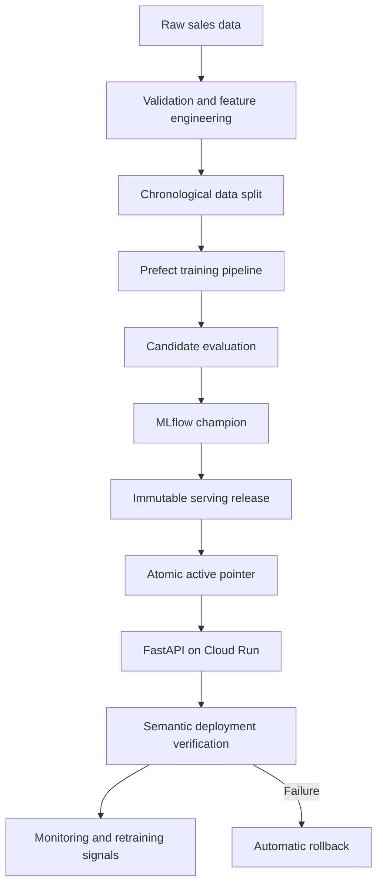
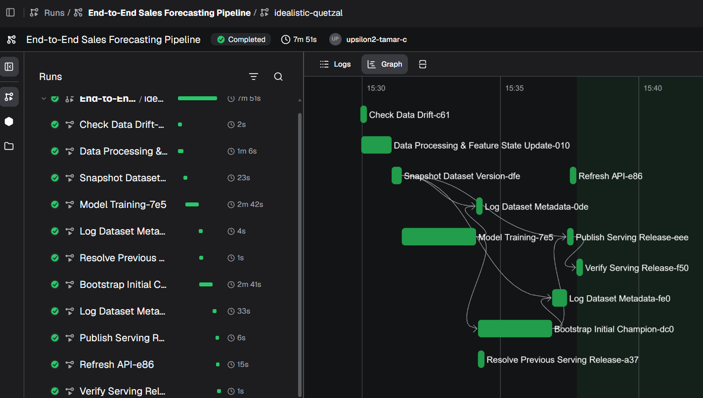
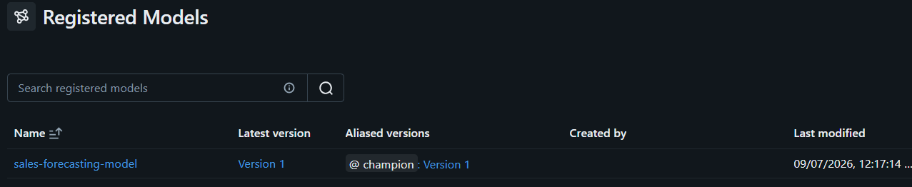
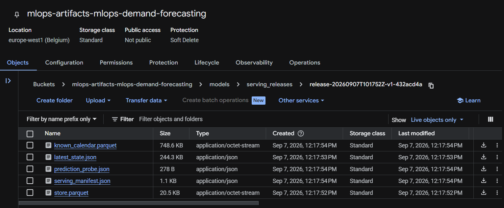
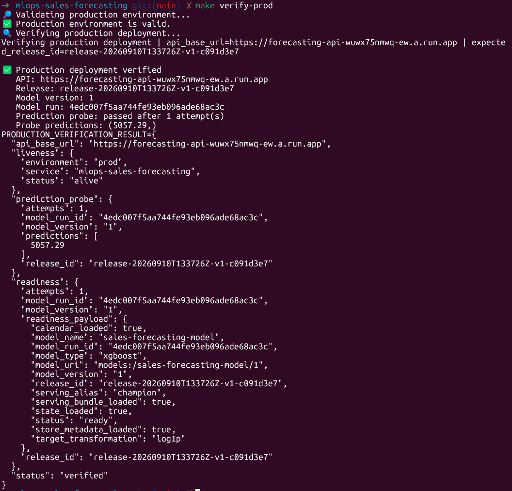
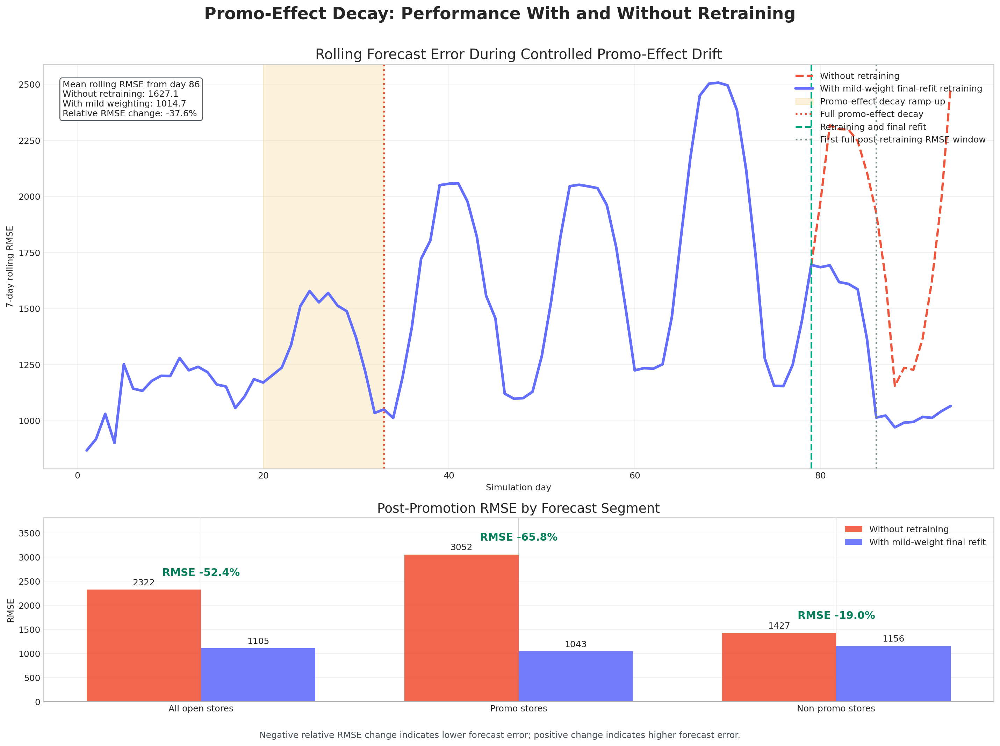
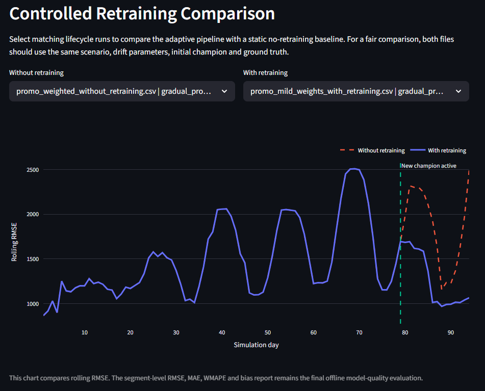
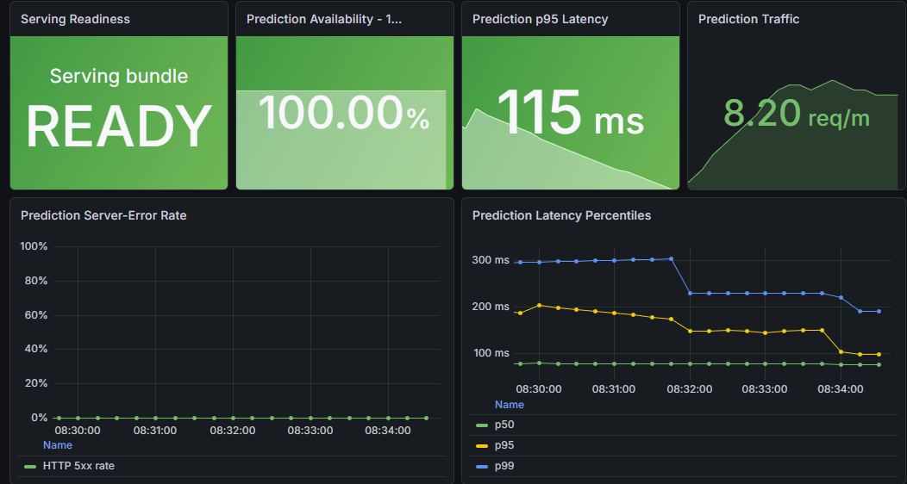
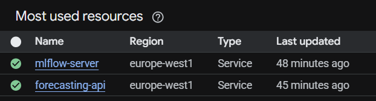

# Production-Grade MLOps for Demand Forecasting

An end-to-end demand forecasting platform demonstrating how machine-learning
models can be trained, evaluated, promoted, deployed, verified, monitored and
retrained safely.

The project combines time-aware model development with production-oriented
MLOps infrastructure. The Rossmann Store Sales dataset provides the forecasting
use case; the main focus is the reusable engineering around the model.


## What This Project Demonstrates

This repository goes beyond model training and notebook experimentation. It
implements the operational lifecycle required to run a forecasting system:

- chronological data preparation and evaluation without future leakage;
- reproducible candidate training and final refitting;
- MLflow experiment tracking and model registry workflows;
- champion/challenger comparison on a shared validation dataset;
- immutable serving releases containing the model and its inference state;
- atomic release activation and rollback;
- FastAPI inference with liveness, readiness and Prometheus endpoints;
- semantic post-deployment verification using a real prediction probe;
- performance, drift and data-quality based retraining decisions;
- scheduled model refresh as a fallback policy;
- API and model monitoring with Prometheus, Grafana and Alertmanager;
- container security scanning, CI/CD and Terraform-managed cloud resources.

| Capability | Implementation |
|---|---|
| Training orchestration | Prefect |
| Experiment tracking | MLflow |
| Model selection | Champion/challenger comparison |
| Production refit | Accepted candidate refitted on train + validation data |
| Online serving | FastAPI on Google Cloud Run |
| Release storage | Immutable serving bundles in Google Cloud Storage |
| Deployment verification | Readiness check + semantic prediction probe |
| Recovery | Automatic rollback to the previous serving release |
| Operational monitoring | Prometheus, Grafana and Alertmanager |
| ML monitoring | Data quality, feature drift, RMSE, MAE and bias |
| Infrastructure | Terraform |
| CI/CD | GitHub Actions |

## Architecture

The platform separates reusable MLOps infrastructure from
forecasting-specific logic.

Reusable components include orchestration, experiment tracking, model
registration, release management, API serving, monitoring, alerting and cloud
deployment. Forecast-specific components include temporal features, store-level
state, regression metrics and delayed ground-truth evaluation.


```mermaid
flowchart TD
    A["Raw sales data"] --> B["Validation and feature engineering"]
    B --> C["Chronological data split"]
    C --> D["Prefect training pipeline"]
    D --> E["Candidate evaluation"]
    E --> F["MLflow champion"]
    F --> G["Immutable serving release"]
    G --> H["Atomic active pointer"]
    H --> I["FastAPI on Cloud Run"]
    I --> J["Semantic deployment verification"]
    J --> K["Monitoring and retraining signals"]
    J -->|Failure| L["Automatic rollback"]
```

### Runtime responsibilities

| Component | Responsibility |
|---|---|
| MLflow | Runs, parameters, metrics, artifacts and registered model versions |
| Prefect | Training, evaluation, promotion and retraining orchestration |
| GCS serving release | Model reference, metadata, feature state, calendar and probe payload |
| Active release pointer | Selects one complete release atomically |
| FastAPI | Validated online inference using the active release |
| Prometheus | Metrics collection and alert-rule evaluation |
| Grafana | SLO and operational dashboards |
| Alertmanager | Alert grouping and delivery routing |

## End-to-End Model Lifecycle

The training flow implements a controlled promotion process:

1. Validate and process the latest data.
2. Generate forecasting features and update store-level state.
3. Create a versioned dataset snapshot.
4. Train a candidate on the chronological training split.
5. Compare candidate and champion on the same validation data and real target scale.
6. Keep the current champion when the candidate is not better.
7. Refit an accepted candidate on the combined training and validation data.
8. Register the final-refit model and assign the `champion` alias.
9. Publish an immutable serving release.
10. Reload the API with the complete release.
11. Verify readiness, release identity and semantic prediction behavior.
12. Roll back automatically if post-deployment verification fails.

<p align="center">
  
</p>

<p align="center">
  <em>Successful Prefect flow from drift evaluation and data processing to champion promotion, release publication and serving verification.</em>
</p>

### Bootstrap, regular training and automatic retraining

The first model is created through a dedicated bootstrap path. Subsequent runs
must compete with the active champion.

| Mode | Purpose |
|---|---|
| Bootstrap | Create the initial champion and first serving release |
| Regular candidate | Evaluate a new candidate against the current champion |
| Forced training | Run candidate training regardless of the pre-training drift check |
| Automatic retraining | Train only when the configured policy requests it |

## Time-Aware Model Development

Forecasting models must be evaluated without using future observations during
training. The project therefore uses chronological splits and walk-forward
backtesting with expanding training windows.

The model-development workflow includes:

- calendar, promotion, holiday, lag and rolling features;
- chronological train and validation splits;
- walk-forward backtesting;
- Optuna-based XGBoost hyperparameter tuning;
- evaluation on the original sales scale;
- RMSE, MAE, WMAPE, RMSPE and bias reporting;
- feature-dtype normalization and MLflow model signatures;
- optional recency weighting during drift retraining.

| Model stage | Mean walk-forward RMSE |
|---|---:|
| Initial baseline | 792.37 |
| Calendar features | 748.31 |
| Tuned XGBoost | 690.49 |

The tuned model reduced mean walk-forward RMSE by approximately 12.9% compared
with the initial baseline. Because folds used for hyperparameter selection also
contribute to this estimate, it is treated as validation performance rather
than a completely untouched final test result.

Run the backtest:

```bash
uv run python scripts/run_model_backtest.py \
  --output-directory results/model_backtest
```

Run an Optuna study:

```bash
uv run python scripts/tune_model.py \
  --trials 20 \
  --folds 2 3
```

## Experiment Tracking and Model Registry

MLflow records the information required to reproduce and review each training
decision:

- model parameters and random seed;
- validation and final-refit metadata;
- training duration and estimated cost;
- evaluation metrics and reports;
- dataset version and configuration hash;
- source commit and environment tags;
- model artifact, input example and model signature;
- candidate/final-refit lineage;
- registered model version and serving alias.

<p align="center">
  
</p>

<p align="center">
  <em>Production MLflow run with model metrics, parameters, lineage metadata and the registered final-refit artifact.</em>
</p>

The registry is used for controlled model versioning. Only an accepted
final-refit model receives the `champion` alias.

<p align="center">
  
</p>

<p align="center">
  <em>Registered forecasting model with a versioned champion alias.</em>
</p>

## Safe Serving Releases

A forecasting model cannot produce correct predictions from model weights
alone. It also requires matching metadata, historical state and calendar data.

Each immutable serving release therefore contains:

- an exact MLflow model name, version and run ID;
- store metadata;
- latest store-level forecasting state;
- known calendar data;
- a semantic prediction-probe payload;
- checksums for release artifacts;
- dataset, configuration and source-control metadata.

The API resolves one active release pointer and loads the complete bundle before
changing its in-memory serving state. A partially loaded candidate can never
replace the currently working bundle.

<p align="center">
  
</p>

<p align="center">
  <em>Versioned GCS serving release containing the manifest, inference state, metadata, calendar and semantic probe.</em>
</p>

### Post-deployment verification

After release activation, the pipeline verifies:

1. process liveness;
2. serving readiness;
3. the expected release ID;
4. the expected model version and run ID;
5. successful execution of the stored prediction probe;
6. a finite and non-negative prediction result.

The probe is marked as deployment verification traffic and is not written to
normal prediction history. If any verification step fails, the previous release
pointer is restored and the API is reloaded.

<p align="center">
  
</p>

<p align="center">
  <em>Independent production verification confirming liveness, readiness, release identity and semantic inference.</em>
</p>

## Automated Retraining Policy

Retraining is a policy decision rather than an unconditional scheduled job.
The collector normalizes evidence from new ground-truth batches, performance
history, feature drift, data quality, cooldown state and configured limits.

A candidate can be trained when:

- enough previously unprocessed ground-truth rows are available;
- data quality is acceptable;
- the retraining budget is available;
- the cooldown has expired; and
- persistent performance degradation, persistent feature drift or the scheduled
  refresh interval requires a new candidate.

Already processed batch IDs are stored in retraining state and are not counted
again. A skipped decision does not falsely mark data as processed.

The scheduled Prefect deployment evaluates this policy regularly. The schedule
does not automatically promote a model: it starts candidate training only when
the policy permits it, and the candidate must still beat the champion.

## Controlled Retraining Experiment

The repository includes a reproducible lifecycle simulation with delayed ground
truth and a controlled decay in promotional effectiveness. Two matched runs are
compared:

- a static champion without retraining;
- an adaptive system using drift-triggered training, recency weighting and final
  refitting.

<p align="center">
  
</p>

<p align="center">
  <em>Rolling error and post-promotion segment performance for static and adaptive forecasting systems.</em>
</p>

| Post-promotion segment | Relative RMSE change |
|---|---:|
| All open stores | -2.4% |
| Promo stores | -6.1% |
| Non-promo stores | +1.4% |

Negative change means lower forecast error. The experiment demonstrates that
retraining can improve the segment affected by drift while still creating
trade-offs elsewhere. It therefore supports segmented evaluation instead of a
blanket claim that every retraining event improves every subgroup.

The Streamlit dashboard exposes lifecycle results and allows matching static
and adaptive runs to be compared interactively.

<p align="center">
  
</p>

## Monitoring, SLOs and Alerting

The monitoring layer separates operational reliability from ML quality.

| Layer | Signals |
|---|---|
| Process health | Liveness and API availability |
| Serving health | Complete serving bundle and active release |
| API reliability | Success rate, 5xx rate, throughput and latency percentiles |
| Data quality | Missing values, schema checks and unseen categories |
| Feature drift | Persistent drift across consecutive windows |
| Forecast quality | Delayed-ground-truth RMSE, MAE and bias |

Prometheus collects API metrics and evaluates alerting rules. Grafana visualizes
service-level indicators, and Alertmanager groups and routes alerts. A local
alert receiver makes the delivery path testable without requiring a real Slack
configuration.

<p align="center">
  
</p>

<p align="center">
  <em>Production SLO dashboard for the forecasting API deployed on Google Cloud Run. The local Prometheus and Grafana stack collects serving readiness, availability, latency, traffic and server-error metrics from the production service.</em>
</p>

## Production Deployment Evidence

The production-style demo is provisioned and deployed on Google Cloud.

### CI/CD

Pushes to `main` execute:

- Ruff linting;
- unit and integration tests;
- an API container smoke test;
- API and MLflow image builds;
- Trivy vulnerability scans;
- image publication to Artifact Registry;
- Cloud Run deployments;
- production deployment verification.

<p align="center">
  
</p>

<p align="center">
  <em>GitHub Actions pipeline from linting and tests to scanned container builds and Cloud Run deployment.</em>
</p>

### Google Cloud resources

Terraform provisions the core cloud resources, including:

- Artifact Registry;
- Google Cloud Storage;
- MLflow on Cloud Run;
- the forecasting API on Cloud Run;
- service accounts and IAM bindings;
- Workload Identity Federation for GitHub Actions.

<p align="center">
  
</p>

<p align="center">
  <em>Cloud Run services for MLflow tracking and production forecasting inference.</em>
</p>

## Technology Stack

| Area | Technology |
|---|---|
| Language | Python 3.12 |
| Forecast model | XGBoost |
| Data processing | pandas, NumPy, PyArrow |
| API | FastAPI, Uvicorn |
| Orchestration | Prefect |
| Tracking and registry | MLflow |
| Local metadata backend | PostgreSQL |
| Artifact and release storage | Google Cloud Storage |
| Monitoring | Prometheus, Grafana |
| Alerting | Alertmanager |
| Containers | Docker, Docker Compose |
| Infrastructure | Terraform |
| Cloud runtime | Google Cloud Run |
| CI/CD | GitHub Actions |
| Security scanning | Trivy |
| Testing and linting | pytest, Ruff |

## Local Quick Start

### Prerequisites

- Docker with Docker Compose;
- Python 3.12;
- `uv`;
- GNU Make.

### 1. Clone and configure

```bash
git clone https://github.com/SL14-SL/mlops-sales-forecasting.git
cd mlops-sales-forecasting
cp .env.example .env
```

Set at least a local `API_KEY` in `.env`. Raw Rossmann files are intentionally
excluded from Git and must be placed under `data/raw/`.

### 2. Start the local stack

```bash
make dev-up
```

| Service | URL |
|---|---|
| Forecasting API | http://localhost:8000 |
| Swagger UI | http://localhost:8000/docs |
| Streamlit | http://localhost:8501 |
| MLflow | http://localhost:5000 |
| Prefect | http://localhost:4221 |
| Grafana | http://localhost:3000 |
| Prometheus | http://localhost:9090 |
| Alertmanager | http://localhost:9093 |

### 3. Bootstrap the first champion

```bash
make train-bootstrap
make predict-test
```

### 4. Register scheduled retraining

```bash
make prefect-setup
make prefect-worker
```

Run the worker in a separate terminal. A one-off policy evaluation can be
executed with:

```bash
make auto-retrain
```

### 5. Run quality checks

```bash
make test
make lint
```

### Useful lifecycle commands

| Command | Purpose |
|---|---|
| `make train-bootstrap` | Create the initial champion and serving release |
| `make train-force` | Force regular candidate training and evaluation |
| `make auto-retrain` | Evaluate the retraining policy once |
| `make predict-test` | Send a test prediction request |
| `make list-serving-releases` | List versioned serving releases |
| `make rollback-serving` | Activate a previous release |
| `make verify-prod` | Verify the active production deployment |

## API Contract

| Method | Endpoint | Purpose |
|---|---|---|
| `GET` | `/livez` | Process liveness |
| `GET` | `/readyz` | Complete serving-bundle readiness |
| `GET` | `/health` | Service health metadata |
| `GET` | `/metrics` | Prometheus metrics |
| `POST` | `/predict` | Single or batch predictions |
| `POST` | `/admin/reload-serving-state` | Atomically reload the active release |

Prediction requests require the configured API key. The response contains the
prediction, release identity, model metadata, request ID, timing measurements
and data-quality evidence.

## Production Demo on Google Cloud

### 1. Configure environment variables

```bash
export GCP_PROJECT_ID="your-project-id"
export GCP_REGION="europe-west1"
export GCP_BUCKET_NAME="your-artifact-bucket"
```

Production service URLs and credentials should be configured through the
environment or GitHub repository secrets rather than committed to source
control.

### 2. Provision infrastructure

```bash
terraform -chdir=infrastructure init
terraform -chdir=infrastructure plan
terraform -chdir=infrastructure apply
```

### 3. Upload raw demo data

```bash
make upload-raw-prod
```

### 4. Build and deploy

Pushes to `main` deploy the scanned API and MLflow images through GitHub
Actions after the required repository variables, secrets and Workload Identity
Federation have been configured.

### 5. Bootstrap and verify production

```bash
make train-bootstrap-prod
make verify-prod
```

### Cost-conscious demo architecture

The portfolio deployment intentionally runs one MLflow Cloud Run instance with
an ephemeral SQLite backend to keep the temporary demonstration inexpensive.
Model artifacts and complete serving releases remain in GCS.

This setup is suitable for a controlled portfolio demonstration, but the
tracking database is not durable across instance or revision replacement. A
continuously operated production system should use PostgreSQL or Cloud SQL as
the persistent MLflow backend.

## Testing and Security

The automated test suite covers:

- feature engineering and target transformations;
- model loading and feature alignment;
- serving-release publication, checksums and pointer activation;
- API authentication, inference and deployment probes;
- champion/challenger comparison and promotion behavior;
- retraining signal collection and cooldown decisions;
- post-deployment verification and rollback behavior.

Security and reliability controls include:

- API-key protected prediction and admin endpoints;
- non-root container execution where applicable;
- pinned dependencies and reproducible lock files;
- Trivy scanning of API and MLflow images;
- checksummed serving artifacts;
- GitHub Workload Identity Federation instead of static GCP credentials;
- environment-specific configuration;
- health, readiness and semantic verification gates.

## Project Structure

```text
.
├── configs/                 # Environment, training and monitoring configuration
├── dashboard/               # Streamlit lifecycle dashboard
├── docs/                    # Architecture, evidence and operational documentation
├── flows/                   # Prefect training and automatic retraining flows
├── infrastructure/          # Terraform configuration
├── monitoring/              # Prometheus, Grafana and Alertmanager configuration
├── scripts/                 # Backtests, simulations, setup and verification tools
├── src/
│   ├── api/                 # FastAPI application and schemas
│   ├── configs/             # Configuration loading
│   ├── data/                # Validation and preprocessing
│   ├── deployment/          # Post-deployment verification
│   ├── features/            # Forecast feature engineering
│   ├── inference/           # Model loading and serving releases
│   ├── monitoring/          # Quality, drift and performance signals
│   └── training/            # Model building, training and evaluation
├── tests/                   # Unit and integration tests
├── docker-compose.yml
├── Makefile
└── pyproject.toml
```

## Reusability

The infrastructure can be adapted to other time-series and regression use
cases such as inventory, revenue, staffing, traffic, workload or energy-demand
forecasting.

Reusable components:

- orchestration and dataset snapshotting;
- experiment tracking and registry workflows;
- atomic release publication and rollback;
- API health and semantic verification;
- monitoring, SLOs and alert delivery;
- retraining state and policy evaluation;
- Terraform and CI/CD infrastructure.

Components that must be adapted for a new problem:

- input schema and business validation;
- feature engineering and forecasting state;
- target transformation;
- evaluation metrics and promotion thresholds;
- drift features and retraining policy;
- semantic prediction probe.

## Design Decisions and Limitations

This repository is a production-oriented portfolio implementation, not a fully
managed enterprise forecasting platform.

Important design decisions and limitations:

- the cloud demo favors low temporary cost over a persistent MLflow database;
- raw data is excluded from version control;
- online predictions are point forecasts rather than probabilistic intervals;
- the project currently focuses on one-step store-level forecasting;
- hyperparameter tuning does not use a separate untouched final test period;
- the controlled drift experiment is synthetic and demonstrates behavior rather
  than future business impact;
- production IAM and secret-rotation policies would require organization-specific
  hardening;
- continuously running cloud monitoring would require additional managed
  infrastructure and budget.

Potential extensions include hierarchical forecasting, prediction intervals,
managed Cloud SQL, cloud-native centralized logging, automated cost budgets,
shadow evaluation and broader multi-horizon backtesting.

## Documentation

Detailed architecture and operational documentation is available in:

- [System architecture](docs/architecture.md)
- [Local development](docs/local-development.md)
- [Google Cloud production demo](docs/production-demo.md)
- [Serving releases and rollback](docs/serving-releases.md)
- [Automatic retraining policy](docs/retraining-policy.md)
- [Monitoring, SLOs and alerting](docs/monitoring-and-slos.md)
- [Incident response runbook](docs/operations-runbook.md)


## Dataset

The project uses the Rossmann Store Sales dataset as a realistic store-level
demand-forecasting scenario. It contains daily sales observations, promotions,
store availability, school holidays, state holidays and store metadata.

Raw dataset files are intentionally excluded from version control. Users are
responsible for obtaining the dataset and complying with its original license
and usage conditions.

## License

This project is licensed under the MIT License.

## Author

**Steffen Lauterbach**  
MLOps Engineer

Focused on production-oriented ML systems, safe model deployment, monitoring,
retraining workflows and cloud-native infrastructure.
