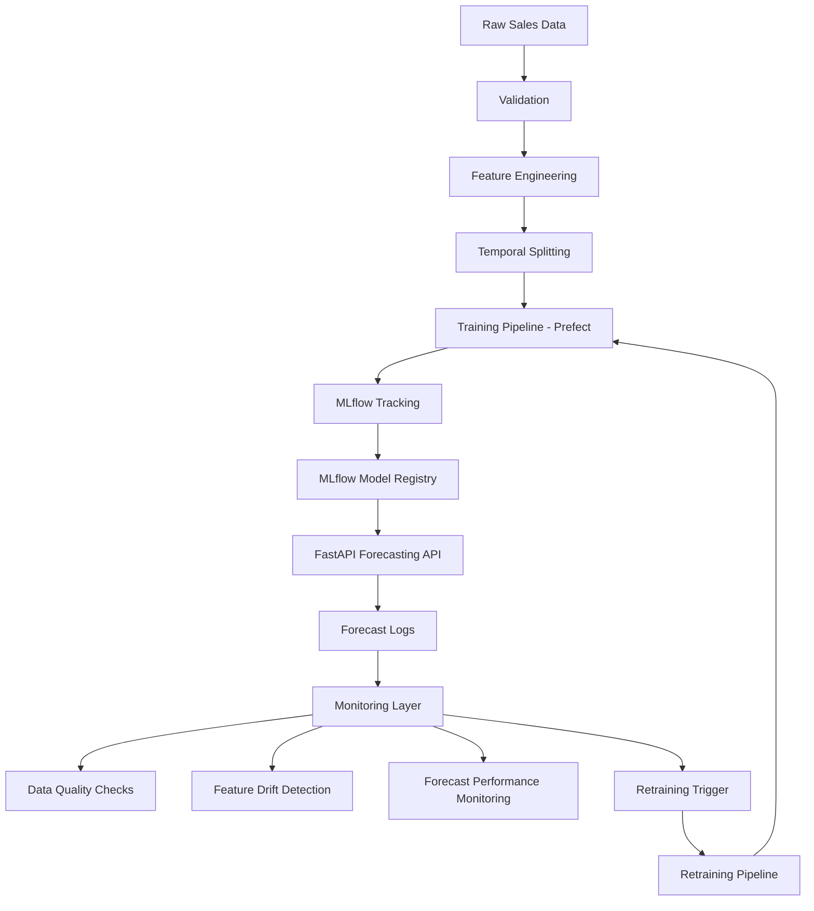
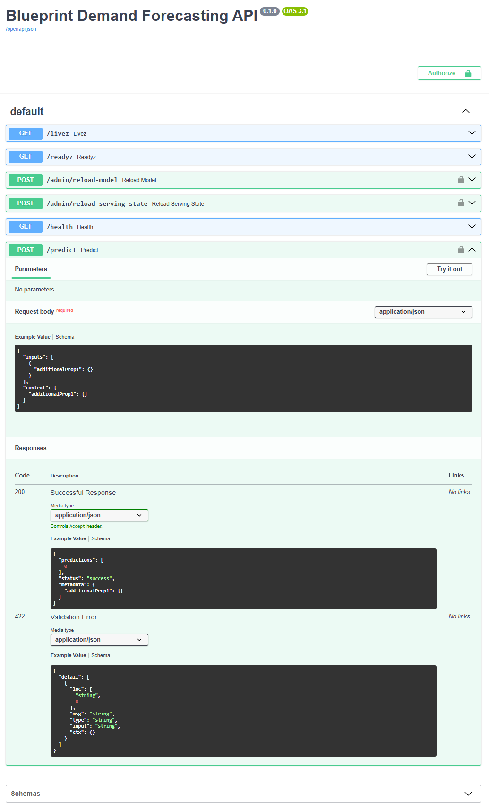
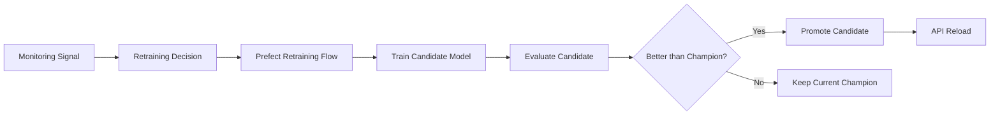
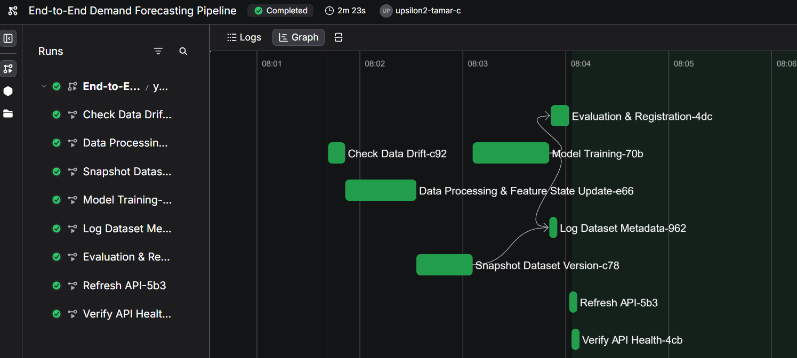
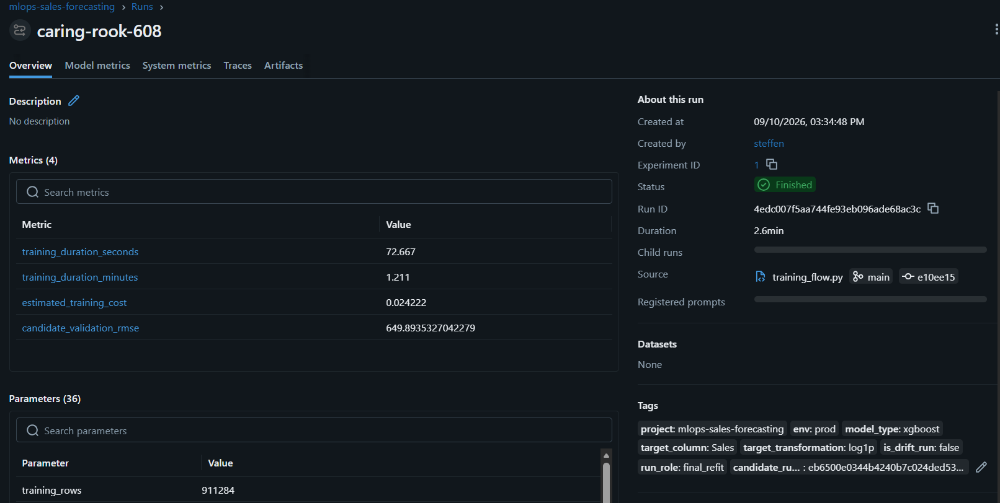
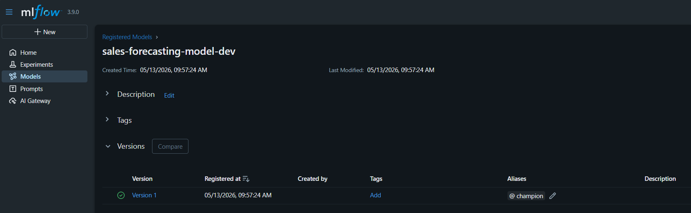
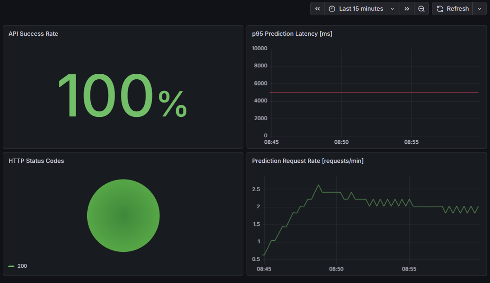
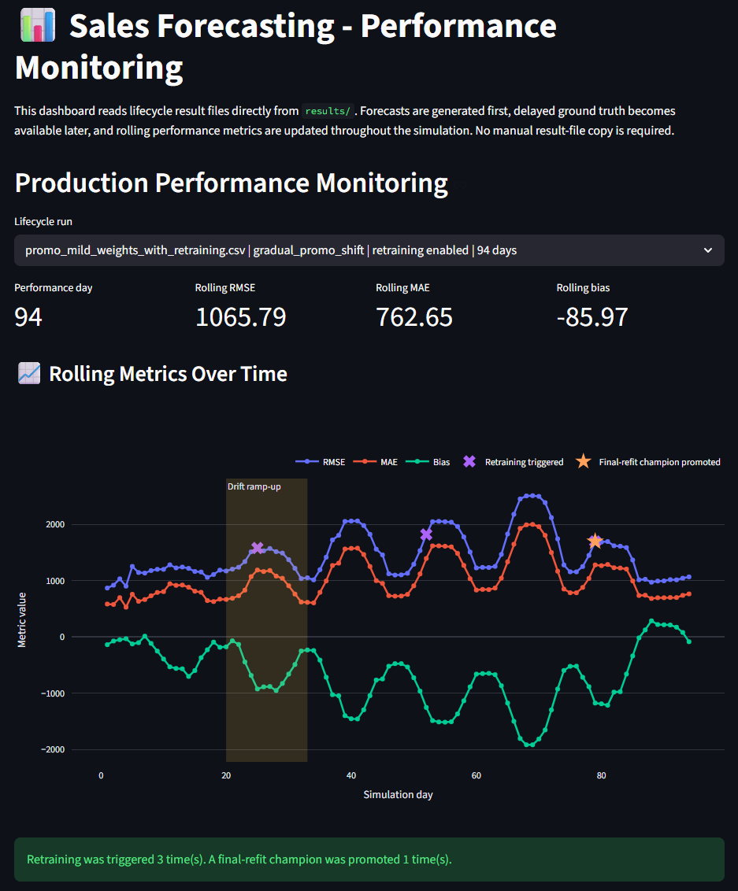
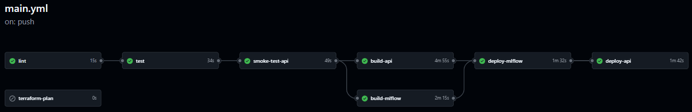

# 🚀 Production-Oriented MLOps Blueprint for Sales Forecasting

End-to-end MLOps showcase for deploying, monitoring and continuously improving machine learning models in a cloud-native production-style environment.

This project uses sales forecasting as the example use case, but the architecture is designed around reusable MLOps patterns: model serving, experiment tracking, model registry workflows, monitoring, automated retraining, CI/CD and infrastructure-as-code.

The focus is not only model training — but the engineering layer required to operate forecasting models reliably after they have been trained.

The platform combines:

* FastAPI for online forecast serving
* MLflow for experiment tracking and model registry workflows
* Prefect for training and retraining orchestration
* Docker for containerized local development
* Terraform for infrastructure-as-code
* GitHub Actions for CI/CD
* Prometheus & Grafana for operational monitoring
* Google Cloud Platform for cloud deployment

---


---

# 🎯 What This Project Demonstrates

This project demonstrates how to build a production-oriented ML system for time-dependent prediction problems.

It shows how to:

- serve sales forecasts through a FastAPI prediction service
- track experiments, parameters, metrics and artifacts with MLflow
- promote models through a champion/challenger workflow
- orchestrate training and retraining pipelines with Prefect
- handle forecasting-specific feature engineering and temporal state
- monitor prediction quality, data quality and feature drift
- expose operational API metrics with Prometheus and Grafana
- deploy reproducibly with Docker, Terraform, GitHub Actions and Google Cloud Run

The goal is to demonstrate reusable MLOps patterns for operating forecasting systems reliably over time.

---

# 🧩 Blueprint Positioning

This repository is part of a reusable MLOps blueprint series.

The goal is not to optimize one specific dataset, but to demonstrate how the same production-oriented ML architecture can be adapted to different machine learning problem types.

| Project | Problem Type | Use Case | Main Adapted Components |
|---|---|---|---|
| Customer Churn MLOps | Binary Classification | Retention risk prediction | Classification metrics, churn decision logic, delayed labels |
| Sales Forecasting MLOps | Time Series / Regression | Demand prediction | Temporal features, forecasting state, regression monitoring |

This project demonstrates the forecasting variant of the blueprint.

The core lifecycle remains the same across both projects:

1. ingest and validate data
2. build features
3. train and evaluate candidate models
4. track experiments and artifacts
5. register models in MLflow
6. serve the active champion model through an API
7. log predictions and operational metadata
8. monitor quality, drift and performance
9. trigger retraining when needed
10. deploy reproducibly through CI/CD and infrastructure-as-code

The forecasting use case mainly changes the domain-specific layers: temporal feature generation, forecast validation, regression metrics, state handling and monitoring policy.

---

# 🖥️ Demo Highlights

The repository includes screenshots and examples for:

- FastAPI Swagger UI for forecast serving
- MLflow experiment tracking and model registry
- Prefect training and retraining orchestration
- Streamlit dashboard for forecast performance monitoring
- Grafana dashboard for operational API metrics
- GitHub Actions CI/CD pipeline

These screenshots are generated from the reproducible local Docker Compose stack and demonstrate the main MLOps capabilities end-to-end.

---

# 🏗️ Architecture Overview

The platform implements a complete operational ML lifecycle for sales forecasting.


```mermaid
flowchart TB
A[Raw Sales Data] --> B[Validation]
B --> C[Feature Engineering]
C --> D[Temporal Splitting]
D --> E[Training Pipeline - Prefect]
E --> F[MLflow Tracking]
F --> G[MLflow Model Registry]
G --> H[FastAPI Forecasting API]

H --> I[Forecast Logs]
I --> J[Monitoring Layer]

J --> K[Data Quality Checks]
J --> L[Feature Drift Detection]
J --> M[Forecast Performance Monitoring]
J --> N[Retraining Trigger]

N --> O[Retraining Pipeline]
O --> E
```

The architecture separates reusable MLOps infrastructure from use-case-specific forecasting logic.

Reusable layers include:

- configuration management
- data validation
- training orchestration
- experiment tracking
- model registry workflows
- model serving
- monitoring
- retraining
- deployment automation

Forecasting-specific layers include:

- temporal feature engineering
- store-level forecasting state
- regression evaluation
- forecast performance monitoring
- demand-oriented inference logic

---

# ⭐ MLOps Capabilities

- production-style forecast serving
- MLflow experiment tracking
- MLflow Model Registry integration
- champion/challenger model promotion
- automated training and retraining workflows
- forecasting-specific feature engineering
- temporal validation and data splitting
- prediction logging
- feature drift monitoring
- data quality monitoring
- API metrics with Prometheus
- Grafana dashboard support
- Dockerized local development stack
- Terraform-based cloud infrastructure
- GitHub Actions CI/CD pipeline
- container vulnerability scanning
- Google Cloud Run deployment

---

# 🔌 API & Forecast Serving

The project exposes a FastAPI service for online forecasting.

The API supports:

- single forecast requests
- batch forecast requests
- model readiness and liveness checks
- active model metadata
- model reload endpoint
- API authentication
- structured forecast responses
- request metadata and timing information

The serving layer loads the active champion model from MLflow and applies the required forecasting feature logic before generating predictions.

<p align="center">
  
</p>

<p align="center">
  <em>FastAPI Swagger UI with health, admin reload and forecast prediction endpoints.</em>
</p>

---

# 📈 Forecasting-Specific Inference Layer

Forecasting problems require more than simply passing a row of features into a model.

This project includes a dedicated inference layer for forecasting-specific concerns:

- forecast input contracts
- feature dispatch logic
- temporal feature generation
- store-level metadata handling
- forecasting state loading
- reusable inference context
- single and batch prediction handling

The goal is to keep forecasting logic explicit and testable instead of hiding it inside the API endpoint.

This makes the project easier to extend to other demand prediction or time-dependent regression use cases.

---

# 🔁 Automated Training & Retraining

Training and retraining workflows are orchestrated with Prefect.

The pipeline automates:

- drift checks before training
- raw data ingestion and validation
- feature processing and feature state updates
- dataset snapshotting
- model training
- model evaluation and registration
- MLflow logging
- API refresh after model promotion
- retraining trigger evaluation

Retraining can be triggered when monitoring detects quality degradation, feature drift or performance issues.


```mermaid
flowchart LR
A[Monitoring Signal] --> B[Retraining Decision]
B --> C[Prefect Retraining Flow]
C --> D[Train Candidate Model]
D --> E[Evaluate Candidate]
E --> F{Better than Champion?}
F -->|Yes| G[Promote Candidate]
F -->|No| H[Keep Current Champion]
G --> I[API Reload]
```

<p align="center">
  
</p>

<p align="center">
  <em>Prefect flow run for the end-to-end demand forecasting pipeline, including drift checks, feature processing, model training, evaluation, registration and API refresh.</em>
</p>  

---

# 📊 Experiment Tracking & Model Evaluation

MLflow is used for experiment tracking, artifact logging and model registry workflows.

Tracked information includes:

- model parameters
- training metrics
- validation metrics
- evaluation reports
- feature schema artifacts
- model artifacts
- dataset and run metadata
- estimated training costs

Forecasting evaluation focuses on regression-oriented quality metrics such as forecast error and model stability over time.

The Model Registry enables controlled promotion of new model versions and supports reproducible deployment workflows.

<p align="center">
  
</p>

<p align="center">
  <em>MLflow run overview with tracked parameters, training metrics, cost estimates and registered model artifacts.</em>
</p>

---

# 🏆 Model Registry & Promotion Workflow

Models are versioned and promoted through the MLflow Model Registry.

The project supports:

- registered model versions
- champion model selection
- reproducible model artifacts
- deployment metadata
- registry-based model loading
- API reload without rebuilding the image

The serving API loads the currently active model from the registry.

This creates a clean separation between:

- training a model
- registering a model
- promoting a model
- serving a model

That separation is an important production MLOps pattern because it allows controlled model updates without tightly coupling training and serving.

<p align="center">
  
</p>

<p align="center">
  <em>MLflow Model Registry with versioned forecasting models and a champion alias for controlled production serving.</em>
</p>

---

# 📡 Monitoring & Observability

The project includes monitoring capabilities for both ML quality and operational service health.

Monitoring features include:

- feature drift detection
- data quality checks
- prediction logging
- forecast performance tracking
- retraining trigger evaluation
- API request metrics
- latency monitoring
- service health checks
- Prometheus metrics endpoint
- Grafana dashboard support

The monitoring layer evaluates whether the currently deployed champion model still satisfies expected production quality requirements.

Operational API metrics are collected through Prometheus and visualized in Grafana, including success rate, prediction latency, status codes and request throughput.

<p align="center">
  
</p>

<p align="center">
  <em>Grafana dashboard for operational API monitoring with success rate, p95 prediction latency, HTTP status codes and prediction request throughput.</em>
</p>

---

# 📉 Forecast Performance Monitoring

Forecasting systems are vulnerable to changing demand patterns, seasonality shifts, promotions, holidays and store-level behavior changes.

The project therefore includes monitoring logic for:

- prediction history
- ground-truth comparison
- forecast error tracking
- performance degradation
- retraining decision support

This mirrors a common real-world forecasting setup: predictions are generated first, while actual sales values become available later and can then be used to evaluate model quality.

The Streamlit dashboard visualizes rolling RMSE, MAE and bias over simulated production days. It also highlights automated retraining triggers and gated champion promotion, where a challenger model is only promoted if it improves over the existing champion.

<p align="center">
  
</p>

<p align="center">
  <em>Forecast performance monitoring dashboard showing rolling metrics, automated retraining triggers and gated champion/challenger promotion.</em>
</p>

---

# 🧠 Business Context

The current project focuses on the technical MLOps lifecycle for sales forecasting.

In a real business environment, forecasts can be connected to operational decision layers such as:

- inventory planning
- staffing recommendations
- promotion planning
- demand risk alerts
- understock and overstock prevention
- store-level replenishment support
- capacity planning
- revenue forecasting

The forecasting model itself produces predicted demand, but the production value comes from turning those forecasts into operational decisions.

A possible extension would be a business decision layer that translates forecasts into actions such as:

| Forecast Signal | Possible Business Action |
|---|---|
| Expected high demand | Increase stock or staffing |
| Expected low demand | Reduce inventory exposure |
| Forecast above baseline | Investigate promotion or seasonal effect |
| Forecast below baseline | Trigger demand risk alert |
| Large forecast error | Flag store/date combination for review |

This keeps the project focused on MLOps while leaving room for a realistic business-facing extension.

---

# 🔄 Continuous ML Lifecycle

This platform demonstrates a complete production ML lifecycle:

1. a model is trained and evaluated
2. the model is logged to MLflow
3. a candidate model is registered
4. the best model is promoted as champion
5. the API serves forecasts using the champion model
6. predictions and metadata are logged
7. monitoring evaluates quality, drift and performance
8. retraining is triggered when needed
9. a new candidate model is trained
10. the model is promoted only if it improves production quality

The goal is not a static forecasting model — but a continuously monitored and maintainable forecasting system.

---

# 🔁 When Retraining Happens

Retraining is triggered when monitoring detects that the current champion model may no longer be reliable.

Potential retraining signals include:

- feature drift
- degraded forecast accuracy
- data quality issues
- newly available ground truth
- scheduled retraining windows
- explicit monitoring trigger flags

The retraining workflow trains a new candidate model and compares it against the current champion.

A newly trained model should only be promoted if it improves the relevant evaluation criteria.

This prevents uncontrolled model replacement and supports stable production behavior.

---

# 🧪 End-to-End Lifecycle Demo

The repository includes demo scripts for simulating an operational forecasting lifecycle.

The demo can simulate:

- forecast batch generation
- newly available ground truth
- forecast performance evaluation
- retraining trigger checks
- performance comparison with and without retraining

After starting the local Docker Compose stack and running the initial training pipeline, execute:

```bash
make demo-forecasting-lifecycle
```

This runs the lifecycle simulation and demonstrates how forecasts are generated, logged, evaluated and used for retraining decision support.

The resulting performance history is stored under:

```text
results/performance_demo_history.csv
```
The generated history is used by the Streamlit monitoring dashboard to visualize rolling forecast metrics, retraining events and champion promotion decisions.

The demo helps illustrate how the forecasting system can be monitored after deployment and how performance signals can support retraining decisions.

---

# ☁️ Infrastructure Stack

## Core Stack

* Python 3.12
* FastAPI
* MLflow
* Prefect
* scikit-learn
* XGBoost
* Pandas
* Docker

## Cloud & DevOps

* Google Cloud Run
* Google Artifact Registry
* Google Cloud Storage
* Terraform
* GitHub Actions
* Prometheus
* Grafana

---

# 📁 Project Structure

```text
.
├── configs/               # environment, training and monitoring configs
│   ├── dev.yaml
│   ├── staging.yaml
│   ├── prod.yaml
│   ├── gcp.yaml
│   ├── monitoring.yaml
│   └── training.yaml
│
├── src/                   # application source code
│   ├── api/               # FastAPI application and request schemas
│   ├── data/              # ingestion, validation, features and splits
│   ├── deployment/        # deployment CLI and cloud config
│   ├── inference/         # forecasting inference logic and model loading
│   ├── monitoring/        # drift, performance, serving and trigger logic
│   ├── training/          # training, evaluation and registration
│   └── utils/             # shared utilities
│
├── flows/                 # Prefect training and retraining flows
├── infrastructure/        # Terraform infrastructure
├── monitoring/            # Prometheus configuration
├── scripts/               # helper scripts and lifecycle demos
├── tests/                 # unit and integration tests
├── docs/                  # deployment docs and screenshots
└── .github/workflows/     # CI/CD pipeline
```

---

# ⚡ Quick Start

The local demo starts the full MLOps stack with Docker Compose:

- FastAPI forecasting API
- MLflow tracking server
- Prefect orchestration server
- PostgreSQL backend
- Prometheus metrics
- Grafana dashboard

After starting the services, run the training pipeline once to register an initial champion model.

## 1️⃣ Clone repository

```bash
git clone <your-repo-url>
cd sales-forecasting-mlops
```

---

## 2️⃣ Configure environment

```bash
cp .env.example .env
```

Set required variables:

* API_KEY
* GCP configuration, optional for local development

---

## 3️⃣ Start local services

```bash
make dev-up
```

This starts:

* FastAPI
* MLflow
* Prefect
* PostgreSQL
* Prometheus
* Grafana

---

## 4️⃣ Run training pipeline

```bash
make train-force
```

This executes:

* ingestion
* validation
* feature engineering
* temporal splitting
* model training
* MLflow logging
* model registration

---

## 5️⃣ Optional: Run API outside Docker

```bash
uv run uvicorn src.api.app:app --host 0.0.0.0 --port 8080
```

---

## 6️⃣ Run tests

```bash
pytest tests -v
```

---

# 🔧 Configuration

The platform follows a configuration-driven architecture.

## Environment configs

* `configs/dev.yaml`
* `configs/prod.yaml`
* `configs/gcp.yaml`
* `configs/monitoring.yaml`
* `configs/training.yaml`

## Environment switching

```bash
APP_ENV=dev
APP_ENV=prod
```

Configuration values can be injected through:

* YAML config files
* environment variables
* GitHub Actions variables
* GitHub Actions secrets
* GCP deployment configuration

This enables reproducible deployments across local, staging and production-style environments.

---

# ☁️ Deployment

Infrastructure is provisioned with Terraform.

Services can be deployed to Google Cloud using:

* Cloud Run
* Artifact Registry
* Google Cloud Storage
* GitHub Actions
* Workload Identity Federation

## Terraform

```bash
cd infrastructure
terraform init
terraform apply
```

## GitHub Actions

CI/CD automatically handles:

* linting
* testing
* API smoke testing
* Terraform validation and planning
* Docker image builds
* vulnerability scanning
* container registry publishing
* Cloud Run deployment

The pipeline validates, builds, scans and deploys the services automatically on pushes to `main`.

<p align="center">
  
</p>

<p align="center">
  <em>GitHub Actions CI/CD pipeline with linting, tests, API smoke checks, container builds, vulnerability scanning and cloud deployment steps.</em>
</p>

---

# 📈 API Endpoints

If a live demo deployment is active, the API exposes:

## Swagger Documentation

```text
https://YOUR_API_URL/docs
```

---

## Health & Readiness Endpoints

```text
GET https://YOUR_API_URL/livez
GET https://YOUR_API_URL/readyz
```

---

## Metrics Endpoint

```text
GET https://YOUR_API_URL/metrics
```

---

## Monitoring Summary

```text
GET https://YOUR_API_URL/monitoring/summary
```

---

## Prediction Endpoint

```text
POST https://YOUR_API_URL/predict
```

---

## Model Reload Endpoint

```text
POST https://YOUR_API_URL/admin/reload-model
```

---

# 📦 Dataset

This project uses store-level sales data as a realistic forecasting use case.

The dataset is not the main focus of the repository. It serves as a concrete example for demonstrating reusable MLOps architecture patterns for time-dependent prediction problems.

The project uses the forecasting scenario to demonstrate:

- temporal feature engineering
- data validation
- time-aware splitting
- model training
- model registry workflows
- API-based forecast serving
- prediction logging
- performance monitoring
- drift detection
- retraining workflows
- CI/CD deployment

The main focus is operational ML infrastructure, reproducibility and lifecycle automation.

---

# 🎯 Project Goals

This repository focuses on the operational layer of machine learning systems:

* production-oriented ML engineering
* model serving and API deployment
* experiment tracking and model registry workflows
* monitoring and observability
* reproducible training and inference pipelines
* CI/CD for ML services
* automated retraining and model promotion
* forecasting-specific inference handling
* cloud-native deployment patterns

The emphasis is on reliable ML infrastructure — not just model training or notebook experimentation.

---

# 🔁 Reusable Use Cases

Sales forecasting is used as the example use case in this repository.

The same MLOps architecture can be adapted to other forecasting or regression problems where predictions need to be served, monitored and improved over time, such as:

- demand forecasting
- inventory forecasting
- revenue forecasting
- traffic forecasting
- workload forecasting
- capacity planning
- staffing demand prediction
- energy consumption forecasting
- support ticket volume forecasting
- marketplace supply and demand prediction

The sales forecasting use case is therefore mainly a vehicle for demonstrating reusable MLOps patterns: model serving, experiment tracking, registry-based promotion, monitoring, retraining, reproducibility and CI/CD.

---

# ⚠️ Limitations

This repository is a production-oriented portfolio showcase, not a fully managed enterprise forecasting platform.

For a real enterprise deployment, I would additionally consider:

- centralized cloud logging and alerting
- stricter IAM scoping per environment
- managed secret rotation
- explicit SLO definitions
- automated rollback workflows
- shadow model evaluation or canary deployment
- advanced backtesting workflows
- richer forecast explainability
- hierarchical forecasting support
- holiday and event calendar integration
- probabilistic forecasts and prediction intervals
- cost monitoring and budget alerts
- data privacy controls for business-specific datasets
- blue/green deployment strategies

The goal of this project is to demonstrate realistic MLOps architecture patterns in a compact and reproducible showcase.

---

# 📄 License

MIT License

---

# 👨‍💻 Author

**Steffen Lauterbach**  
MLOps Engineer

Focused on production-oriented ML systems, model deployment, monitoring, retraining workflows and cloud-native ML infrastructure.

LinkedIn:  
https://www.linkedin.com/in/92-steffen-lauterbach