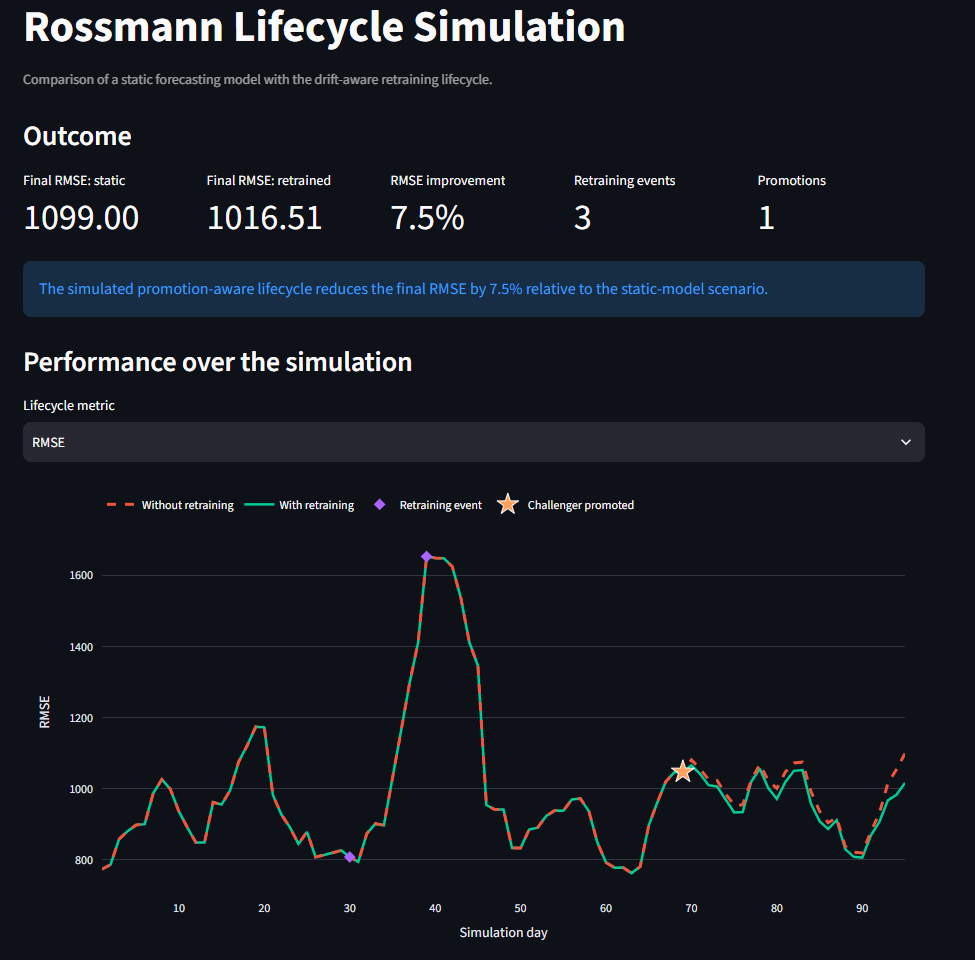
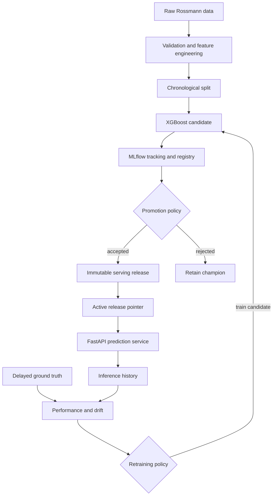

# Production-Oriented MLOps for Sales Forecasting

An end-to-end sales forecasting system demonstrating how models can be
trained, evaluated, promoted, served, monitored and retrained through a
controlled operational lifecycle.

The Rossmann Store Sales dataset provides the forecasting use case. The main
focus is the engineering required to move from a model artifact to a
reproducible and observable serving system.


## Project Case Study

Retail sales forecasting is not only a regression problem. Reliable serving
also requires synchronized store metadata, historical forecasting state,
calendar coverage, delayed-label evaluation and safe model replacement.

This project implements that complete lifecycle:

- validate and version Rossmann data;
- build leakage-safe temporal and store-level features;
- train and evaluate an XGBoost candidate;
- track runs and register model versions with MLflow;
- compare challengers against the active champion;
- publish immutable releases containing model and inference state;
- serve authenticated forecasts through FastAPI;
- monitor reliability, drift and delayed-label performance;
- evaluate policy-controlled retraining through Prefect;
- reproduce lifecycle behavior through an isolated simulation;
- deploy the API using Terraform and keyless GitHub Actions authentication.

## Key Result

The checked-in lifecycle simulation introduces a gradual reduction in
promotional effectiveness and compares two matched scenarios:

- a static champion without retraining;
- a managed lifecycle with monitoring-triggered candidate training and gated
  promotion.

| Result | Static champion | Managed lifecycle |
|---|---:|---:|
| Final RMSE | `2487.88` | `1065.79` |
| Relative final RMSE improvement | — | `57.2%` |
| Candidate retraining events | `0` | `3` |
| Champion promotions | `0` | `1` |

The important result is not simply that retraining occurred. Three candidate
runs were triggered, but only the final challenger passed the promotion gates
and changed the active serving release.

Versioned reference results are available in
[`examples/lifecycle_simulation/`](examples/lifecycle_simulation/).

<p align="center">
  
</p>

<p align="center">
  <em>
    The static and managed scenarios follow the same model until an approved
    challenger is promoted. The managed lifecycle finishes with a 57.2% lower
    RMSE after three retraining events and one promotion.
  </em>
</p>

## What This Project Demonstrates

| Capability | Implementation |
|---|---|
| Forecasting model | XGBoost regression with `log1p` target transformation |
| Time-aware validation | Chronological training and validation splits |
| Feature engineering | Temporal, lag, rolling, promotion, competition and holiday features |
| Experiment tracking | MLflow parameters, metrics, signatures and artifacts |
| Model lifecycle | Registered challenger and champion aliases |
| Promotion safety | Overall, segment and bias quality gates |
| Serving state | Immutable manifests with checksummed forecasting artifacts |
| Online inference | FastAPI with API-key authentication |
| Release activation | Validated active pointer and atomic in-process reload |
| Recovery | Independent serving-release and Cloud Run rollback |
| Orchestration | Prefect training and scheduled retraining deployments |
| Operational monitoring | Prometheus, Grafana and Alertmanager |
| ML monitoring | Delayed-label RMSE, MAE, bias and feature drift |
| Operations view | Streamlit monitoring and simulation dashboards |
| Cloud deployment | Terraform, Cloud Run, GCS and Artifact Registry |
| CI and security | GitHub Actions, Ruff, pytest, pip-audit and Trivy |

## Architecture


```mermaid
flowchart TD
    A[Raw Rossmann data] --> B[Validation and feature engineering]
    B --> C[Chronological split]
    C --> D[XGBoost candidate]
    D --> E[MLflow tracking and registry]
    E --> F{Promotion policy}
    F -->|accepted| G[Immutable serving release]
    F -->|rejected| H[Retain champion]
    G --> I[Active release pointer]
    I --> J[FastAPI prediction service]
    J --> K[Inference history]
    L[Delayed ground truth] --> M[Performance and drift]
    K --> M
    M --> N{Retraining policy}
    N -->|train candidate| D
```

The system deliberately separates:

- model registration from model promotion;
- promotion from serving-release activation;
- application deployment from model rollback;
- service reliability from model-quality monitoring;
- retraining authorization from champion replacement.

See [System architecture](docs/architecture.md) for component boundaries and
runtime responsibilities.

## End-to-End Lifecycle

A normal training lifecycle:

1. ingests and validates source data;
2. builds known-calendar and forecasting features;
3. persists the latest store-level forecasting state;
4. creates chronological train and validation splits;
5. trains an XGBoost candidate;
6. evaluates predictions on the original sales scale;
7. logs the run and model signature to MLflow;
8. registers the candidate;
9. compares it with the current champion;
10. publishes a release only after successful promotion;
11. activates the release pointer;
12. makes the complete bundle available to the API.

A model version cannot serve forecasts by itself. The active release also
contains:

- store metadata;
- latest forecasting state;
- known calendar;
- target transformation;
- model and dataset lineage;
- artifact checksums.

See [Serving releases](docs/serving-releases.md) for publication, activation
and rollback guarantees.

## Local Quick Start

### Prerequisites

- Python 3.12.9
- `uv`
- Docker with Docker Compose
- GNU Make

### Install and configure

```bash
git clone \
  git@github.com:SL14-SL/mlops-sales-forecasting-next.git

cd mlops-sales-forecasting-next

cp .env.example .env
uv sync --locked
```

Change the development API key in `.env` before exposing the application
outside your local machine.

### Add the Rossmann data

Place the source files under:

```text
data/raw/train.csv
data/raw/store.csv
data/raw/test.csv
```

Raw data is excluded from Git. Users are responsible for obtaining the
Rossmann Store Sales dataset and complying with its original license and usage
conditions.

### Run quality checks

```bash
make check
docker compose config --quiet
```

### Start local services

Start MLflow:

```bash
make mlflow-up
```

Start the API:

```bash
make api-rebuild
```

Start the full monitoring stack:

```bash
make monitoring-up
```

Start Prefect when orchestration is required:

```bash
make prefect-up

export PREFECT_API_URL=http://127.0.0.1:4200/api

make prefect-pool
make prefect-deploy
make prefect-worker
```

`make prefect-worker` runs in the foreground and should normally use a separate
terminal.

### Local endpoints

| Service | URL |
|---|---|
| Forecasting API | `http://localhost:8000` |
| Swagger UI | `http://localhost:8000/docs` |
| Streamlit dashboard | `http://localhost:8501` |
| MLflow | `http://localhost:5000` |
| Prefect | `http://localhost:4200` |
| Prometheus | `http://localhost:9090` |
| Alertmanager | `http://localhost:9093` |
| Grafana | `http://localhost:3000` |

See [Local development](docs/local-development.md) for the complete setup and
service workflow.

## API Contract

### Health

Process liveness:

```bash
curl \
  --fail \
  http://localhost:8000/livez
```

Serving readiness:

```bash
curl \
  --include \
  http://localhost:8000/readyz
```

Readiness returns HTTP `503` until a complete active serving release has been
loaded.

### Prediction

Predictions require the configured API key:

```bash
curl \
  --request POST \
  --header "Content-Type: application/json" \
  --header "X-API-Key: replace-with-a-local-development-key" \
  --data '{
    "inputs": [
      {
        "Store": 1,
        "Date": "2026-09-28",
        "Open": 1,
        "Promo": 1,
        "StateHoliday": "0",
        "SchoolHoliday": 0
      }
    ]
  }' \
  http://localhost:8000/predict
```

Each input row represents one store and forecast date. The serving layer:

1. validates the request;
2. joins release-specific store metadata;
3. joins the known calendar;
4. injects lag and rolling state;
5. aligns features with the model contract;
6. applies the inverse target transformation.

Unknown stores, malformed fields and dates outside the known calendar are
rejected with HTTP `422`.

## Monitoring and Dashboards

Prometheus metrics are exposed at:

```text
http://localhost:8000/metrics
```

The aggregate model-operational state is exposed at:

```text
http://localhost:8000/monitoring/summary
```

The Streamlit dashboard combines:

- active release and readiness;
- rolling RMSE, MAE and bias;
- feature-drift results;
- automated-retraining state;
- estimated training costs;
- lifecycle-simulation results.

Grafana provides service-oriented views for traffic, latency, errors,
readiness and model-observability metrics.

The monitoring store writes only explicitly allowlisted inference fields.
Technical application logs do not contain raw request records or prediction
values.

See [Monitoring, SLOs and alerting](docs/monitoring-and-slos.md) for metric
definitions, thresholds and alert rules.

## Lifecycle Simulation

The project includes a reproducible simulation of delayed Ground Truth,
promotional drift, monitoring decisions, candidate training and controlled
promotion.

Start MLflow and Prefect:

```bash
make mlflow-up
make prefect-up

export PREFECT_API_URL=http://127.0.0.1:4200/api
```

Run the static baseline:

```bash
uv run python \
  scripts/run_lifecycle_simulation.py \
  --config dev.yaml \
  --retraining disabled
```

Run the managed lifecycle:

```bash
uv run python \
  scripts/run_lifecycle_simulation.py \
  --config dev.yaml \
  --retraining enabled
```

Simulation state is isolated under:

```text
data/simulation/runtime/
```

Generated results are written below:

```text
examples/lifecycle_simulation/generated/
```

The simulation does not modify the normal development release pointer or
serving artifacts.

Open `http://localhost:8501` and select **Lifecycle Simulation** to compare
static and managed runs interactively.

## Automated Retraining

The Prefect deployment evaluates monitoring evidence daily at 03:00 in the
`Europe/Berlin` timezone.

The policy considers:

- validated and previously unprocessed Ground Truth;
- minimum and maximum row limits;
- persistent forecast degradation;
- persistent drift for the same feature;
- cooldown state;
- scheduled-refresh interval;
- duplicate decision IDs.

Possible actions are:

- `block`;
- `skip`;
- `train_candidate`.

A candidate changes serving only after passing the independent promotion
policy. See [Retraining policy](docs/retraining-policy.md).

## Cloud Deployment

The Google Cloud reference deployment uses:

- Cloud Storage for Terraform state and application artifacts;
- Workload Identity Federation for keyless GitHub Actions authentication;
- Artifact Registry for immutable container images;
- Secret Manager for the API key;
- Cloud Run for the serving API;
- Terraform for reproducible infrastructure.

The included stack does not provision managed MLflow, Prefect or a cloud
training worker. Those services must be supplied separately for a complete
cloud-hosted training lifecycle.

Deployment follows a reviewed plan-before-apply workflow:

```bash
gh workflow run \
  deploy.yml \
  --field environment=dev \
  --field apply_changes=false
```

After reviewing the uploaded Terraform plan:

```bash
gh workflow run \
  deploy.yml \
  --field environment=dev \
  --field apply_changes=true
```

See:

- [Cloud deployment](docs/cloud-deployment.md)
- [Google Cloud production demo](docs/production-demo.md)

## Testing and Security

The repository includes:

- unit tests for domain and infrastructure components;
- integration tests for API and real MLflow lifecycle behavior;
- Ruff linting;
- locked dependency resolution with `uv`;
- API container smoke testing;
- dependency auditing with `pip-audit`;
- repository and container scanning with Trivy;
- non-root container execution;
- API-key protected prediction and admin endpoints;
- environment-specific secret injection;
- checksummed immutable serving artifacts;
- keyless GitHub-to-Google-Cloud authentication.

Run the local quality gate:

```bash
make check
docker compose config --quiet
git diff --check
```

GitHub Actions workflows cover CI, security scanning, Terraform validation,
deployment and Cloud Run rollback.

## Technology Stack

| Area | Technology |
|---|---|
| Language | Python 3.12 |
| Forecasting | XGBoost, pandas, NumPy |
| Data artifacts | Parquet and JSON |
| API | FastAPI and Uvicorn |
| Tracking and registry | MLflow |
| Orchestration | Prefect |
| Storage abstraction | fsspec and gcsfs |
| Monitoring | Prometheus and Grafana |
| Alerting | Alertmanager |
| Dashboard | Streamlit and Plotly |
| Containers | Docker and Docker Compose |
| Infrastructure | Terraform |
| Cloud | Google Cloud Run, GCS and Artifact Registry |
| CI/CD | GitHub Actions |
| Quality and security | pytest, Ruff, pip-audit and Trivy |

## Project Structure

```text
.
├── configs/                         # Environment and lifecycle configuration
├── docs/                            # Architecture and operations documentation
├── examples/lifecycle_simulation/  # Versioned reference experiment results
├── infrastructure/                 # Terraform bootstrap and application stack
├── monitoring/                     # Prometheus, Grafana and Alertmanager
├── scripts/                        # Lifecycle simulation entry point
├── src/mlops_sales_forecasting/
│   ├── api/                        # FastAPI application and routers
│   ├── configs/                    # Configuration and environment handling
│   ├── data/                       # Ingestion, validation and features
│   ├── inference/                  # Prediction and serving releases
│   ├── monitoring/                 # Performance, drift and dashboards
│   ├── notifications/              # Lifecycle event delivery
│   ├── orchestration/              # Prefect lifecycle flows
│   ├── pipeline/                   # Reusable training pipeline contracts
│   ├── simulation/                 # Isolated lifecycle simulation
│   ├── storage/                    # Local and GCS filesystem abstraction
│   ├── tracking/                   # MLflow and promotion services
│   └── training/                   # XGBoost training and evaluation
└── tests/                           # Unit and integration tests
```

## Design Decisions and Limitations

This is a production-oriented portfolio implementation, not a fully managed
enterprise forecasting platform.

Important limitations:

- raw Rossmann data is excluded from version control;
- forecasts are point estimates rather than prediction intervals;
- the lifecycle experiment uses controlled synthetic drift;
- the reference cloud stack deploys serving infrastructure, not managed
  training infrastructure;
- production thresholds require calibration against real business costs;
- organization-specific networking, retention and IAM policies require
  additional hardening;
- cost monitoring is an engineering estimate rather than provider billing
  data.

Potential extensions include probabilistic forecasts, hierarchical
aggregation, shadow evaluation, managed cloud orchestration and billing-data
integration.

## Documentation

- [System architecture](docs/architecture.md)
- [Local development](docs/local-development.md)
- [Monitoring, SLOs and alerting](docs/monitoring-and-slos.md)
- [Retraining policy](docs/retraining-policy.md)
- [Serving releases](docs/serving-releases.md)
- [Cloud deployment](docs/cloud-deployment.md)
- [Google Cloud production demo](docs/production-demo.md)
- [Operations runbook](docs/operations-runbook.md)
- [Template update workflow](docs/template-updates.md)

## Dataset

The project uses the Rossmann Store Sales dataset, containing daily sales,
promotions, store availability, holidays and store metadata.

Raw files are intentionally excluded from Git.

## License

This project is licensed under the MIT License.

## Author

**Steffen Lauterbach**
MLOps Engineer

Focused on production-oriented ML systems, safe model deployment, monitoring,
retraining workflows and cloud infrastructure.

[LinkedIn](https://www.linkedin.com/in/92-steffen-lauterbach)