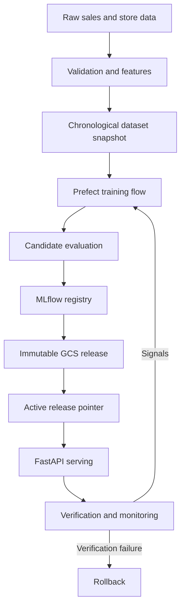
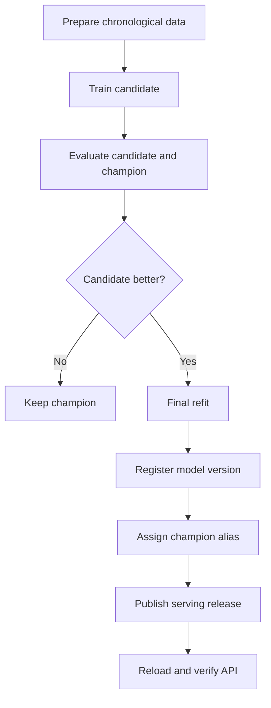

# System Architecture

## Purpose

This document describes the runtime components, ownership boundaries and data
flows of the demand-forecasting platform. The architecture is designed to keep
training, model selection, release publication and online serving independently
testable.

## High-Level Architecture

  

  <em>Completed end-to-end forecasting pipeline covering data processing, model training, champion registration, serving-release publication and semantic verification.</em>

## Component Responsibilities

| Component | Responsibility | Persistent information |
|---|---|---|
| Data pipeline | Validation, temporal features and state updates | Processed data and feature state |
| Prefect | Training and retraining orchestration | Flow and task run metadata |
| MLflow | Experiments, runs, metrics and model versions | Tracking database and artifacts |
| GCS | Dataset snapshots and immutable serving releases | Versioned objects |
| FastAPI | Request validation and prediction serving | No authoritative mutable model state |
| Prometheus | Metric collection and alert-rule evaluation | Time-series metrics |
| Grafana | Operational visualization | Dashboard definitions |
| Alertmanager | Alert grouping and routing | Alert state |
| Terraform | Cloud resource definition | Terraform state |
| GitHub Actions | Validation, image publication and deployment | Workflow history |

## Training and Promotion Flow

The candidate and champion are evaluated on the same chronological validation
data and on the original target scale. An accepted candidate is not served
directly: a separate final model is refitted on the combined training and
validation data.

## Serving Architecture

MLflow and GCS have different responsibilities:

- MLflow is the source of truth for training runs and registered model versions.
- A serving release defines the exact combination of model and inference assets.
- The active pointer selects one complete release.
- The API changes its in-memory state only after the candidate bundle has loaded
  and validated successfully.

This prevents combinations such as new model weights with stale forecasting
state or calendar data.

## Environment Topology

### Local development

Docker Compose starts:

- FastAPI;
- PostgreSQL;
- MLflow;
- Prefect server and optional worker;
- Streamlit;
- Prometheus;
- Grafana;
- Alertmanager and the local alert receiver.

PostgreSQL provides a persistent local MLflow backend. Repository directories
are mounted for data, models, monitoring output and serving releases.

### Google Cloud demonstration

The cloud demonstration uses:

- Cloud Run for MLflow and the forecasting API;
- Artifact Registry for container images;
- GCS for raw data, artifacts, dataset snapshots and serving releases;
- Terraform for resource provisioning;
- GitHub Actions with Workload Identity Federation for deployment.

The low-cost portfolio setup uses one MLflow instance with SQLite. A durable
production environment should replace this with PostgreSQL or Cloud SQL.

  

  <em>Google Cloud Run services hosting MLflow and the production forecasting API.</em>

## Trust Boundaries

| Boundary | Control |
|---|---|
| Client to API | API key and schema validation |
| GitHub to GCP | Workload Identity Federation |
| API to release storage | Dedicated service account and bucket IAM |
| Release activation | Manifest validation and artifact checksums |
| Deployment completion | Readiness and semantic prediction verification |
| Failed deployment | Pointer restoration and API reload |

## Reusable and Domain-Specific Layers

Reusable infrastructure includes orchestration, registry integration, serving
releases, health checks, monitoring, rollback, CI/CD and Terraform.

Domain-specific code includes the request schema, feature transformations,
store-level state, target transformation, evaluation metrics and retraining
thresholds. These parts must be adapted when the blueprint is transferred to a
different forecasting problem.

## Related Documentation

- [Local development](local-development.md)
- [Production demo](production-demo.md)
- [Serving releases](serving-releases.md)
- [Retraining policy](retraining-policy.md)
- [Monitoring and SLOs](monitoring-and-slos.md)

