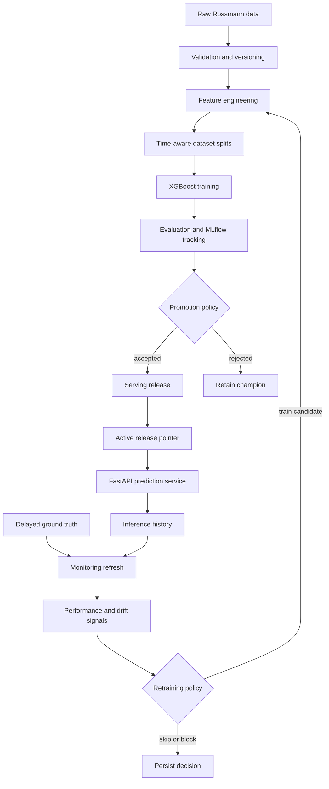
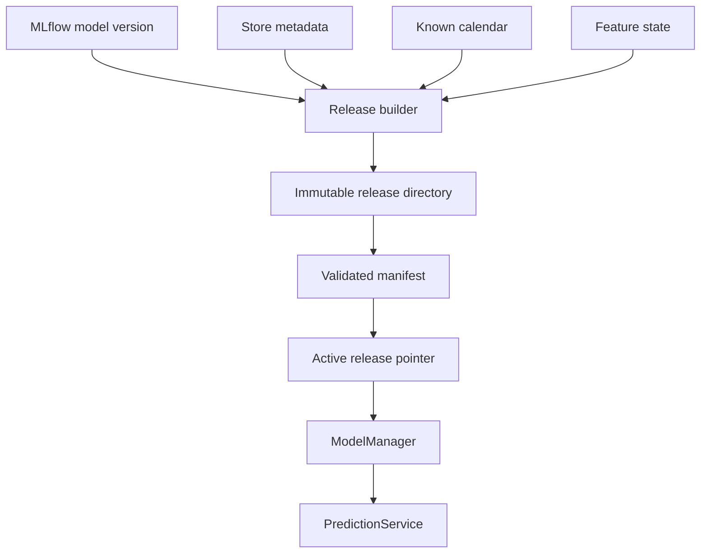

# System Architecture

## Purpose

This document describes the architecture of the Sales Forecasting MLOps
system, the responsibilities of its major components and the boundaries
between reusable MLOps infrastructure and Rossmann-specific forecasting
logic.

The system covers the complete model lifecycle:

- ingestion and validation of Rossmann data;
- time-aware feature engineering and dataset splitting;
- XGBoost training and evaluation;
- MLflow experiment tracking and model registration;
- controlled champion/challenger promotion;
- immutable serving-release publication;
- online forecasting through FastAPI;
- operational and model-quality monitoring;
- scheduled, policy-controlled retraining;
- reproducible lifecycle simulation;
- local Docker Compose and Google Cloud deployment.

## High-Level Architecture

```mermaid
flowchart TD
    A[Raw Rossmann data] --> B[Validation and versioning]
    B --> C[Feature engineering]
    C --> D[Time-aware dataset splits]
    D --> E[XGBoost training]
    E --> F[Evaluation and MLflow tracking]
    F --> G{Promotion policy}
    G -->|accepted| H[Serving release]
    G -->|rejected| I[Retain champion]
    H --> J[Active release pointer]
    J --> K[FastAPI prediction service]
    K --> L[Inference history]
    M[Delayed ground truth] --> N[Monitoring refresh]
    L --> N
    N --> O[Performance and drift signals]
    O --> P{Retraining policy}
    P -->|train candidate| C
    P -->|skip or block| Q[Persist decision]
```

Training, serving and monitoring share configuration and storage contracts,
but they remain separate runtime concerns. A failed training or monitoring
run does not directly modify the model currently used by the API.

## Component Responsibilities

| Area | Implementation | Responsibility |
|---|---|---|
| Configuration | `src/mlops_sales_forecasting/configs/` | Environment selection, YAML loading, environment-variable resolution and path configuration |
| Raw data | `src/mlops_sales_forecasting/data/raw/` | Load and integrate Rossmann source data |
| Validation | `src/mlops_sales_forecasting/data/validation/` | Validate training and inference schemas |
| Feature engineering | `src/mlops_sales_forecasting/data/features/` | Build temporal, lag, rolling, competition, promotion and calendar features |
| Dataset splitting | `src/mlops_sales_forecasting/data/splits/` | Produce time-aware training and validation datasets |
| Training | `src/mlops_sales_forecasting/training/` | Build, fit and evaluate the XGBoost forecasting model |
| Pipeline | `src/mlops_sales_forecasting/pipeline/` | Coordinate pipeline stages and persist run status |
| Tracking | `src/mlops_sales_forecasting/tracking/` | Log MLflow runs, register models and apply promotion policy |
| Serving releases | `src/mlops_sales_forecasting/inference/releases/` | Build, publish, validate, activate and roll back immutable releases |
| Inference | `src/mlops_sales_forecasting/inference/` | Load serving bundles and construct forecasting features |
| HTTP API | `src/mlops_sales_forecasting/api/` | Authentication, request handling, health checks, metrics and administration |
| Monitoring | `src/mlops_sales_forecasting/monitoring/` | Persist inference records, evaluate performance and drift, and expose dashboards |
| Orchestration | `src/mlops_sales_forecasting/orchestration/` | Run training and automated retraining through Prefect |
| Notifications | `src/mlops_sales_forecasting/notifications/` | Dispatch lifecycle events without coupling them to pipeline logic |
| Simulation | `src/mlops_sales_forecasting/simulation/` | Reproduce the delayed-label lifecycle and compare retraining strategies |
| Storage | `src/mlops_sales_forecasting/storage/` | Provide local and object-storage filesystem operations |

## Internal Boundaries

The codebase separates orchestration from domain implementation.

The pipeline layer defines the lifecycle and its contracts. Project adapters
connect that lifecycle to Rossmann-specific ingestion and feature engineering:

- `pipeline/service.py` defines the training-pipeline collaboration;
- `pipeline/runner.py` executes and validates pipeline stages;
- `pipeline/project_adapters.py` persists Rossmann datasets and features;
- `pipeline/project_factory.py` assembles the forecasting implementation;
- `pipeline/repository.py` persists pipeline-run state.

Prefect flows call this application layer instead of reimplementing training
logic. This allows the same pipeline to be exercised directly in tests,
through local commands or through scheduled orchestration.

## Training and Promotion Flow

The regular training lifecycle performs the following steps:

1. load and validate raw Rossmann data;
2. build the known calendar and forecasting features;
3. persist the latest feature state required at inference time;
4. create chronological training and validation splits;
5. train an XGBoost regressor using the configured target transformation;
6. evaluate forecasts on the original sales scale;
7. log parameters, metrics, signatures and artifacts to MLflow;
8. register the candidate model;
9. compare the candidate with the active champion;
10. promote only candidates satisfying the configured policy;
11. publish a serving release for an accepted model;
12. activate the release through the active-release pointer.

The promotion decision and serving activation are distinct operations.
Registering or training a challenger therefore does not automatically change
production predictions.

The primary orchestration entry points are:

- `orchestration/training_flow.py` for regular training;
- `orchestration/lifecycle_adapter.py` for the Prefect-backed lifecycle;
- `tracking/promotion_service.py` for champion/challenger decisions;
- `inference/releases/publisher.py` for release publication.

## Serving Architecture

A serving release is an immutable unit containing the model reference and all
artifacts required to reproduce inference. For the forecasting task this
includes model metadata, store metadata, the known calendar, feature state and
the expected feature contract.

```mermaid
flowchart TD
    A[MLflow model version] --> B[Release builder]
    C[Store metadata] --> B
    D[Known calendar] --> B
    E[Feature state] --> B
    B --> F[Immutable release directory]
    F --> G[Validated manifest]
    G --> H[Active release pointer]
    H --> I[ModelManager]
    I --> J[PredictionService]
```

`inference/model_manager.py` owns the process-local active bundle. It loads a
complete release before replacing the current bundle, preventing requests
from observing a partially loaded release.

`inference/bundle_loader.py` validates and assembles the model and referenced
artifacts. Checksums and safe relative paths protect the integrity of release
contents.

The FastAPI layer exposes:

- `GET /livez` for process liveness;
- `GET /readyz` for serving readiness;
- `POST /predict` for authenticated forecasts;
- `POST /admin/reload` for controlled model reloads;
- `GET /metrics` for Prometheus metrics;
- `GET /monitoring/summary` for persisted model-operational state.

Prediction requests are enriched with store metadata, known calendar data and
the latest forecasting state. Generated features are aligned with the model
contract before prediction, and the configured inverse target transformation
is applied to the result.

## Monitoring Architecture

Operational and model-quality monitoring use different evidence.

Prometheus records service-level metrics such as request counts, status codes,
latency and serving readiness. Grafana visualizes these signals, while
Alertmanager handles configured alerts.

The application monitoring layer persists an allowlisted subset of inference
data. Delayed ground truth is later joined to predictions to calculate rolling
forecast metrics.

The monitoring refresh performs these steps:

1. rebuild cumulative ground truth from available batches;
2. load immutable inference-history partitions;
3. retain the latest prediction for each forecasting key;
4. calculate rolling RMSE, MAE and forecast bias;
5. compare current inference features with reference features;
6. persist performance and feature-drift histories;
7. expose the latest state through the monitoring summary and Streamlit
   dashboard.

Raw API payloads are not written to technical application logs.

## Automated Retraining

The scheduled Prefect deployment does not retrain solely because one metric
crosses a threshold. It first collects normalized evidence and evaluates the
configured policy.

Relevant evidence includes:

- new training rows;
- persistent feature drift;
- sustained performance degradation;
- elapsed time since the previous training run;
- scheduled-refresh status;
- cooldown state;
- whether the same decision has already been processed.

The policy returns one of three actions:

- `skip`;
- `train_candidate`;
- `block`.

A `train_candidate` decision starts the normal training and promotion
lifecycle. The new candidate changes the active serving release only if it
passes the independent model-comparison policy.

Retraining state is persisted so repeated scheduler evaluations do not process
the same decision more than once.

## Trust Boundaries

The architecture uses the following controls:

- API-key authentication for prediction and administrative endpoints;
- schema validation at ingestion and inference boundaries;
- environment-based secret injection rather than committed credentials;
- immutable release directories;
- checksums for serving artifacts;
- safe release identifiers and relative artifact paths;
- explicit promotion and activation decisions;
- readiness checks that fail when no valid bundle is available;
- CI dependency, secret, configuration and container-image scanning;
- Workload Identity Federation instead of long-lived cloud keys.

## Reusable and Domain-Specific Layers

Reusable MLOps capabilities include:

- configuration and storage abstractions;
- pipeline contracts and run persistence;
- MLflow tracking and registry integration;
- promotion policy execution;
- serving-release publication and rollback;
- FastAPI application structure;
- Prefect orchestration;
- monitoring summaries and lifecycle notifications.

Rossmann-specific capabilities include:

- raw dataset normalization;
- sales-specific validation;
- temporal and store-level feature engineering;
- forecasting-state creation and updates;
- known-calendar construction;
- XGBoost target transformation;
- forecast request enrichment and business rules;
- lifecycle-simulation scenarios.

This separation allows the infrastructure patterns to be reused for other
forecasting or classification projects without pretending that feature
engineering and prediction semantics are generic.

## Related Documentation

- [Local development](local-development.md)
- [Monitoring, SLOs and alerting](monitoring-and-slos.md)
- [Retraining policy](retraining-policy.md)
- [Serving releases](serving-releases.md)
- [Cloud deployment](cloud-deployment.md)
- [Production demo](production-demo.md)
- [Operations runbook](operations-runbook.md)
- [Template updates](template-updates.md)
