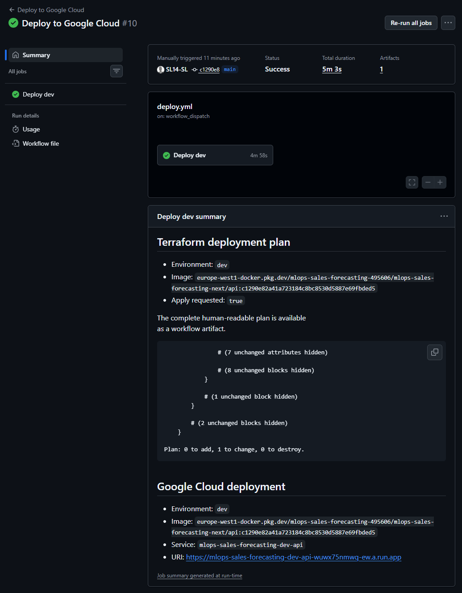
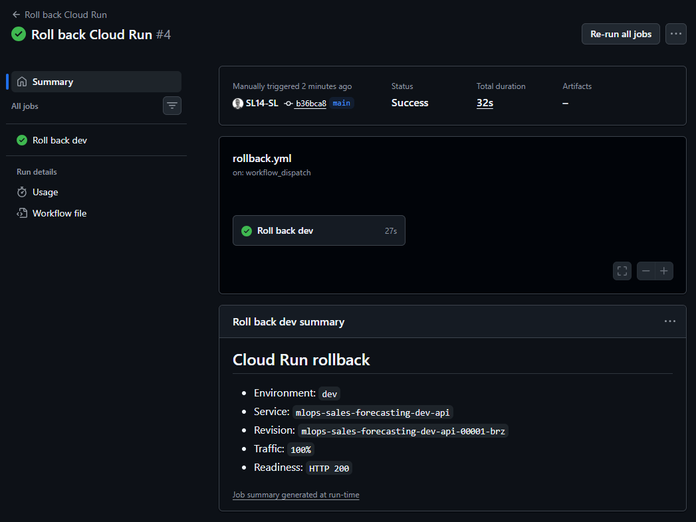

````markdown
# Cloud deployment and rollback verification

This document records the verified deployment and rollback path for the
development environment of the Rossmann forecasting service.

The verification was performed against a real private Google Cloud Run service
on October 2, 2026.

## Deployment architecture

The cloud deployment uses:

- GitHub Actions for deployment orchestration;
- GitHub OpenID Connect and Google Workload Identity Federation for keyless
  authentication;
- Terraform for infrastructure provisioning;
- Artifact Registry for the API container image;
- Google Cloud Run for API serving;
- Google Cloud Storage for portable serving releases;
- Secret Manager for the API key.

The Cloud Run service does not require access to the local MLflow server.
Instead, the active serving release contains a materialized MLflow/XGBoost
model together with the forecasting state and supporting data required for
inference.

## Verified plan-only workflow

GitHub Actions run
[`36978224870`](https://github.com/SL14-SL/mlops-sales-forecasting-next/actions/runs/36978224870)
verified the non-mutating deployment-plan path.

With `apply_changes=false`, the workflow skipped:

- foundational infrastructure apply;
- API-key publication;
- container-registry authentication;
- container build and push;
- Cloud Run deployment apply.

The active Cloud Run revision remained unchanged. The rendered Terraform plan
contained no destructive Cloud Run changes.

## Verified deployment

The deployment was executed through the versioned
[`deploy.yml`](../.github/workflows/deploy.yml) workflow.

GitHub Actions run
[`37000253687`](https://github.com/SL14-SL/mlops-sales-forecasting-next/actions/runs/37000253687)
successfully completed the following steps:

1. authenticated to Google Cloud through Workload Identity Federation;
2. initialized and validated Terraform;
3. planned the foundational and Cloud Run infrastructure;
4. verified that the Cloud Run plan contained no destructive service changes;
5. built the API container image;
6. pushed the image to Artifact Registry;
7. updated the existing Cloud Run service in place;
8. verified that the deployed service was ready.

The Terraform deployment plan reported:

```text
Plan: 0 to add, 1 to change, 0 to destroy.
```

The existing Cloud Run service and its previous revision were preserved.

<p align="center">
  
</p>

## Portable serving release

The deployed service loaded its active serving release from the
environment-specific GCS artifact bucket.

The verified release was:

```text
release-9f2f0965-ab8d-4517-bc9e-3b1f5a2c6558
```

The release contains:

- the materialized MLflow/XGBoost model;
- the MLflow model signature and environment metadata;
- store metadata;
- the known forecasting calendar;
- per-store lag and rolling state;
- a checksum-protected serving manifest.

The active-release pointer is written only after all release artifacts have
been uploaded successfully. Cloud Run therefore observes either the previous
complete release or the new complete release, rather than a partially
published bundle.

## Runtime verification

The deployed Cloud Run service is private. An unauthenticated request to the
service returned HTTP `403`, confirming that Cloud Run IAM authentication is
enforced.

An authenticated readiness request returned HTTP `200`:

```json
{
  "status": "ready",
  "active_release_id": "release-9f2f0965-ab8d-4517-bc9e-3b1f5a2c6558"
}
```

An authenticated and API-key-protected prediction request also returned HTTP
`200`:

```json
{
  "status": "success",
  "release_id": "release-9f2f0965-ab8d-4517-bc9e-3b1f5a2c6558",
  "predictions": [
    {
      "row_index": 0,
      "horizon_step": 1,
      "prediction": 6148.34
    }
  ]
}
```

This verifies the complete runtime path:

```text
Cloud Run IAM
    -> API-key authentication
    -> GCS active-release pointer
    -> portable serving bundle
    -> feature construction
    -> XGBoost inference
```

## Verified Cloud Run revision rollback

Application rollback is implemented through the versioned
[`rollback.yml`](../.github/workflows/rollback.yml) workflow.

A regular Terraform deployment updated the existing Cloud Run service in
place. Cloud Run retained the previous revision and created a second healthy
revision for the new immutable application image.

The two revisions were:

| Role | Revision |
|---|---|
| Previous revision | `mlops-sales-forecasting-dev-api-00001-brz` |
| Newly deployed revision | `mlops-sales-forecasting-dev-api-00002-6rz` |

Before rollback, revision `00002-6rz` was ready and received 100 percent of
service traffic. Revision `00001-brz` remained available as the rollback
target.

GitHub Actions run
[`37005823895`](https://github.com/SL14-SL/mlops-sales-forecasting-next/actions/runs/37005823895)
then executed the rollback workflow. The workflow:

1. resolved the requested target revision;
2. verified that the target revision was ready;
3. routed 100 percent of Cloud Run traffic to the target;
4. verified the resulting traffic assignment;
5. minted a service-account identity token for the private Cloud Run service;
6. called `/readyz` with the service URI as token audience;
7. required an HTTP `200` readiness response before completing successfully.

<p align="center">
  
</p>

The resulting Cloud Run traffic state was:

```text
latest ready revision:
mlops-sales-forecasting-dev-api-00002-6rz

revision receiving 100 percent traffic:
mlops-sales-forecasting-dev-api-00001-brz
```

The latest ready revision remaining `00002-6rz` is expected. Creating a newer
revision and routing production traffic are separate Cloud Run operations.
The rollback changed the traffic target without rebuilding or deleting either
revision.

## Post-rollback verification

After rollback, the workflow authenticated to the private Cloud Run service
through Workload Identity Federation and required `/readyz` to return HTTP
`200`. An authenticated prediction request was also verified against the
rolled-back revision.

The results were:

| Check | Result |
|---|---:|
| Traffic assigned to rollback target | `100%` |
| Automated authenticated `/readyz` | HTTP `200` |
| Authenticated `/predict` | HTTP `200` |
| Active serving release | `release-9f2f0965-ab8d-4517-bc9e-3b1f5a2c6558` |
| Prediction | `6148.34` |

This confirms that the previous application revision remained operational
after traffic was restored to it.

After the rollback verification was complete, traffic was returned to the
latest healthy revision:

```text
100% LATEST
mlops-sales-forecasting-dev-api-00002-6rz
```

Both revisions remained available after the test.

## Scope of the rollback test

This verification demonstrates a real Cloud Run application-revision
rollback. It covers:

- non-destructive Terraform deployment planning;
- preservation of the previous Cloud Run revision;
- deployment of a new immutable container-image revision;
- revision discovery;
- target-readiness validation;
- traffic reassignment;
- post-rollback API readiness;
- post-rollback model inference.

The rollback target and the newly deployed revision used distinct immutable
container-image digests. The test therefore verifies that a regular Terraform
deployment preserves the previous Cloud Run revision and that the operational
rollback workflow can restore traffic to it without rebuilding or deleting
either revision.

Model-release rollback is a separate operation. Model releases are activated
through the GCS serving-release pointer, allowing the serving bundle to be
changed independently of the Cloud Run application revision.
````