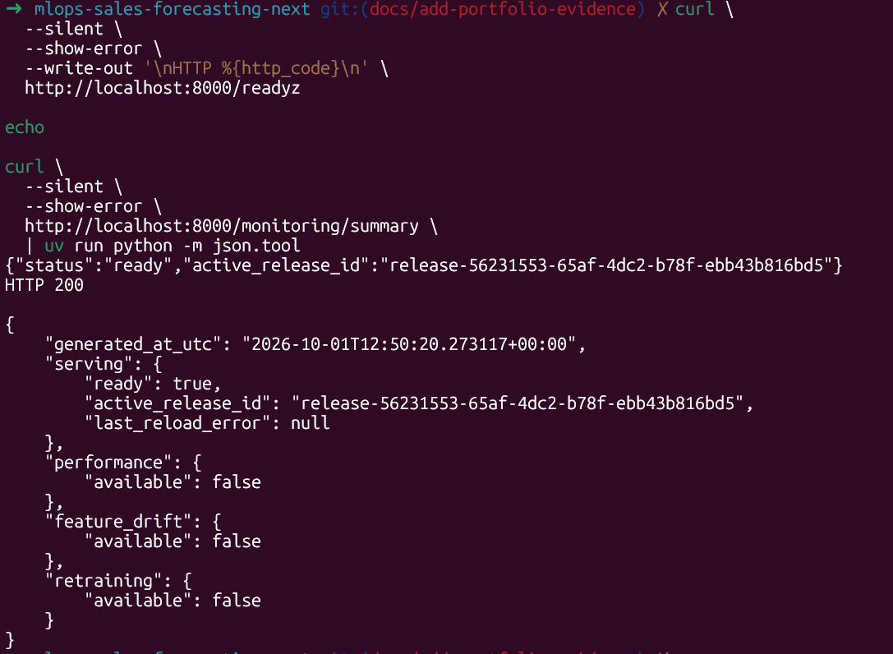

# Local Development

## Purpose

This guide describes how to configure, run and verify the complete Sales
Forecasting MLOps environment locally.

The project can run individual components independently or start grouped
Docker Compose profiles for tracking, orchestration and monitoring.

## Prerequisites

Install the following tools:

- Python 3.12;
- `uv`;
- Docker with Docker Compose;
- Git;
- `make`;
- `curl`.

Optional tools such as `jq` improve command-line output but are not required.

Verify the main tools:

```bash
python --version
uv --version
docker --version
docker compose version
```

## Configure the Project

Create the local environment file:

```bash
cp .env.example .env
```

Review at least these values in `.env`:

```dotenv
APP_ENV=dev
API_KEY=replace-with-a-local-development-key
MLFLOW_TRACKING_URI=http://localhost:5000
PREFECT_API_URL=http://127.0.0.1:4200/api
```

The default development configuration is stored in:

```text
configs/dev.yaml
```

Install the locked Python dependencies:

```bash
uv sync --locked
```

Verify the configuration and test suite:

```bash
uv run ruff check .
uv run pytest -q
docker compose config --quiet
```

## Local Data

The Rossmann source files are expected under:

```text
data/raw/train.csv
data/raw/store.csv
```

The optional Kaggle test dataset may also be stored at:

```text
data/raw/test.csv
```

These datasets are intentionally excluded from Git. They must be downloaded
or copied into the project before running the real training pipeline.

Verify that the training data can be loaded:

```bash
uv run python - <<'PY'
from mlops_sales_forecasting.configs.loader import (
    load_config,
)
from mlops_sales_forecasting.data.raw.ingest import (
    load_base_datasets,
)

config = load_config()
train, store = load_base_datasets(
    config["paths"]["raw_data"]
)

print(f"train rows: {len(train)}")
print(f"store rows: {len(store)}")
print(
    "training period: "
    f"{train['Date'].min().date()} "
    f"to {train['Date'].max().date()}"
)
PY
```

## Service Overview

| Service | URL | Compose profile |
|---|---|---|
| Forecasting API | `http://localhost:8000` | default |
| Swagger UI | `http://localhost:8000/docs` | default |
| Streamlit dashboard | `http://localhost:8501` | `monitoring` |
| MLflow | `http://localhost:5000` | `tracking` |
| Prefect | `http://localhost:4200` | `orchestration` |
| Prometheus | `http://localhost:9090` | `monitoring` |
| Alertmanager | `http://localhost:9093` | `monitoring` |
| Grafana | `http://localhost:3000` | `monitoring` |

Host commands use `localhost`. Containers communicate through Compose service
names such as `api`, `mlflow` and `prefect-server`.

## Start Individual Components

Build and start the API:

```bash
make api-rebuild
```

Inspect its status and logs:

```bash
make api-ps
make api-logs
```

Start MLflow:

```bash
make mlflow-up
make mlflow-ps
```

Start Prefect:

```bash
make prefect-up
make prefect-ps
```

Start the monitoring stack:

```bash
make monitoring-rebuild
make monitoring-ps
```

The monitoring stack includes the API, Streamlit dashboard, MLflow,
Prometheus, Alertmanager and Grafana.

## Verify the API

Check process liveness:

```bash
curl \
  --fail \
  --silent \
  --show-error \
  http://localhost:8000/livez
```

Before the first serving release exists, readiness returns HTTP `503`. This is
expected:

```bash
curl \
  --silent \
  --show-error \
  --write-out '\nHTTP %{http_code}\n' \
  http://localhost:8000/readyz
```

After a valid release has been activated, the same endpoint returns HTTP
`200` and the active release ID.

<p align="center">
  
</p>

<p align="center">
  <em>
    Readiness requires a successfully loaded immutable serving release; the
    monitoring summary exposes the same active release identifier.
  </em>
</p>

## Prefect Deployment and Worker

Configure the Prefect API for commands running on the host:

```bash
export PREFECT_API_URL=http://127.0.0.1:4200/api
```

Create the local process work pool and register deployments:

```bash
make prefect-pool
make prefect-deploy
```

During deployment, decline an additional interactive schedule for
`local-training`. The configured schedule for `auto-retraining` is loaded from
`prefect.yaml`.

Start the worker in a separate terminal:

```bash
export PREFECT_API_URL=http://127.0.0.1:4200/api
make prefect-worker
```

Inspect the registered resources:

```bash
uv run prefect deployment ls
uv run prefect work-pool ls
```

Trigger the regular training deployment manually:

```bash
uv run prefect deployment run \
  'mlops-sales-forecasting-training/local-training'
```

Trigger the retraining-policy evaluation manually:

```bash
uv run prefect deployment run \
  'mlops-sales-forecasting-auto-retraining/auto-retraining'
```

## Serving Release Operations

The API loads the release referenced by:

```text
artifacts/models/active_serving_release.json
```

When no valid pointer exists, `/livez` remains healthy while `/readyz` returns
HTTP `503`.

After publishing or activating a release, reload the API process safely:

```bash
curl \
  --fail \
  --request POST \
  --header "X-API-Key: ${API_KEY}" \
  http://localhost:8000/admin/reload
```

Verify the active release:

```bash
curl \
  --fail \
  --silent \
  --show-error \
  http://localhost:8000/readyz
```

Release rollback changes the active-release pointer to a previously validated
release. See [Serving releases](serving-releases.md) for the release format
and rollback semantics.

## Quality Checks

Run all project tests and static checks:

```bash
make check
```

The equivalent explicit commands are:

```bash
uv run ruff check .
uv run pytest -q
docker compose config --quiet
git diff --check
```

## Related Documentation

- [System architecture](architecture.md)
- [Monitoring, SLOs and alerting](monitoring-and-slos.md)
- [Retraining policy](retraining-policy.md)
- [Serving releases](serving-releases.md)
- [Operations runbook](operations-runbook.md)
