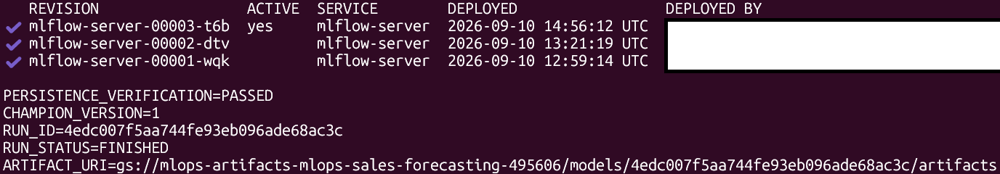

# Google Cloud Production Demo

## Purpose and Scope

This guide describes the temporary Google Cloud deployment used to demonstrate
the production lifecycle. It proves that the same training, release and
verification logic works outside the local Docker Compose environment.

It is intentionally cost-conscious and is not presented as a continuously
operated enterprise platform.

## Cloud Resources

Terraform provisions:

- an Artifact Registry repository;
- a GCS artifact bucket;
- a Cloud SQL PostgreSQL instance and MLflow database;
- a Secret Manager secret for the database password;
- an MLflow Cloud Run service connected to Cloud SQL;
- a forecasting API Cloud Run service;
- service accounts and IAM bindings;
- Workload Identity Federation for GitHub Actions.

<p align="center">
  
</p>

<p align="center">
  <em>
    MLflow on Cloud Run using Cloud SQL for persistent tracking metadata
    and GCS for model artifacts.
  </em>
</p>

<p align="center">
  
</p>

<p align="center">
  <em>
    Cloud Run services hosting the MLflow tracking server and the
    production forecasting API in europe-west1.
  </em>
</p>

The real prediction service is named `forecasting-api`. Avoid creating a second
placeholder service with a different name, because it causes infrastructure
drift and confusing public URLs.

## Required Local Configuration

Load the project environment after opening a new terminal:

```bash
set -a
source .env
set +a
```

At minimum, configure:

```text
GCP_PROJECT_ID=your-project-id
GCP_REGION=europe-west1
GCP_BUCKET_NAME=your-unique-artifact-bucket
MLFLOW_URL=https://your-mlflow-service.run.app
PREDICTION_API_URL=https://your-api-service.run.app/predict
PRODUCTION_API_URL=https://your-api-service.run.app
```

Do not commit production API keys or service credentials.

Authenticate when necessary:

```bash
gcloud auth login
gcloud auth application-default login
gcloud config set project "$GCP_PROJECT_ID"
gcloud auth application-default set-quota-project "$GCP_PROJECT_ID"
```

## Provision Infrastructure

```bash
terraform -chdir=infrastructure init
terraform -chdir=infrastructure fmt -check
terraform -chdir=infrastructure validate
terraform -chdir=infrastructure plan
terraform -chdir=infrastructure apply
```

Read the generated service URLs:

```bash
terraform -chdir=infrastructure output mlflow_url
terraform -chdir=infrastructure output forecasting_api_url
```

Store the raw URL values in `.env`, without placeholder brackets or shell
assignment syntax:

```text
MLFLOW_URL=https://mlflow-server-....run.app
MLFLOW_TRACKING_URI=https://mlflow-server-....run.app
PREDICTION_API_URL=https://forecasting-api-....run.app/predict
PRODUCTION_API_URL=https://forecasting-api-....run.app
```

Reload `.env` after changing it: 

```bash
set -a
source .env
set +a
```

Review every replacement or deletion in the plan before applying it. In
particular, verify Cloud Run service names, IAM targets and bucket operations.

Do not commit `tfplan`, `tfplan.txt`, `.terraform/` or state files.

## Upload Raw Demo Data

Raw data is excluded from Git. Upload it after the bucket exists:

```bash
make upload-raw-prod
```

Confirm the uploaded objects:

```bash
gcloud storage ls \
  "gs://${GCP_BUCKET_NAME}/data/raw/"
```

## CI/CD Deployment

GitHub Actions performs:

1. linting and tests;
2. API smoke testing;
3. API and MLflow container builds;
4. Trivy vulnerability scans;
5. Artifact Registry publication;
6. Cloud Run deployment;
7. production verification where configured.

<p align="center">
  
</p>

<p align="center">
  <em>
    Successful GitHub Actions pipeline covering linting, tests,
    API smoke testing, vulnerability-scanned image builds and
    Cloud Run deployment.
  </em>
</p>

Infrastructure deployment is gated by the GitHub repository variable
`DEPLOY_GCP`. Enable it only after Terraform has provisioned the required
resources:

```bash
gh variable set DEPLOY_GCP --body true
```

Set it back to `false` before destroying the infrastructure:

```bash
gh variable set DEPLOY_GCP --body false
```

Linting, tests and security checks can continue to run while cloud deployment
is disabled.

Required repository configuration includes the Artifact Registry path, project
and region variables, API secrets and Workload Identity Federation values.

## Bootstrap Production

The first production model requires a bootstrap run:

```bash
make train-bootstrap-prod
```

The target ensures that the Cloud SQL instance and MLflow health endpoint are
available before running the production training pipeline. It should not be used when a champion already
exists in the current MLflow backend.

Successful output includes:

- candidate and final-refit run IDs;
- registered model version;
- immutable release ID;
- `champion_promoted: true`;
- `deployment_status: verified`;
- successful prediction-probe evidence.

## Verify Production Independently

```bash
make verify-prod
```

The verification script checks:

- the environment does not point to local services;
- API liveness;
- API readiness;
- expected release, model version and run ID;
- semantic prediction-probe execution;
- finite and valid prediction output.

<p align="center">
  
</p>

<p align="center">
  <em>
    Independent verification of the production API, active serving
    release, model lineage and semantic prediction behavior.
  </em>
</p>

Verification must use the API base URL for health endpoints and the `/predict`
URL only for prediction traffic.

## Inspect Cloud Run

```bash
gcloud run services describe forecasting-api \
  --project "$GCP_PROJECT_ID" \
  --region "$GCP_REGION" \
  --format='yaml(metadata.name,status.url,status.traffic)'

gcloud run services describe mlflow-server \
  --project "$GCP_PROJECT_ID" \
  --region "$GCP_REGION" \
  --format='yaml(metadata.name,status.url,status.traffic)'
```

Inspect errors:

```bash
gcloud logging read \
  'resource.type="cloud_run_revision" AND severity>=ERROR' \
  --project "$GCP_PROJECT_ID" \
  --freshness=30m \
  --limit=100
```

## Cost-Conscious Persistent MLflow Configuration

The demonstration uses:

- Cloud SQL for PostgreSQL as the persistent tracking and registry backend;
- GCS for model artifacts and immutable serving releases;
- Secret Manager for the database password;
- an MLflow Cloud Run service with scale-to-zero enabled;
- a maximum of one MLflow Cloud Run instance;
- Terraform-managed infrastructure that can be destroyed after verification.

Cloud Run revision replacement does not remove MLflow experiments, registered
models or aliases because this metadata is stored in Cloud SQL. Model artifacts
remain independently persisted in GCS.

Cloud SQL does not scale to zero and is therefore the largest ongoing cost of
the demonstration. For a portfolio deployment, provision it only for the
bootstrap, verification and screenshot session, then destroy the infrastructure.

## Verify MLflow Persistence

After bootstrapping production, record the registered model and champion alias.
Then create a new MLflow Cloud Run revision and verify that the same registry
metadata remains available.

The verification performed for this project confirmed:

- the MLflow health endpoint remained available;
- the registered forecasting model remained present;
- the `champion` alias still referenced the same model version;
- the model run ID remained unchanged;
- the production API remained ready and passed its semantic prediction probe.

<p align="center">
  
</p>

<p align="center">
  <em>
    Registered model lineage and GCS artifact location verified after
    replacing the MLflow Cloud Run revision.
  </em>
</p>

## Memory and Scaling

The MLflow Cloud Run service is configured with the Terraform-defined CPU,
memory and instance limits used for the production demonstration. The verified
deployment operated with one CPU, 1 GiB of memory, scale-to-zero and at most
one MLflow instance.

MLflow UI, registry and artifact operations should still be monitored during
larger workloads. If resource limits need to be increased, change the Terraform
configuration rather than applying a permanent manual Cloud Run override.

Manual `gcloud run services update` commands create a new revision and may
introduce Terraform drift. After an emergency manual change, update and apply
the Terraform configuration so that declared and actual infrastructure match.

## Teardown

Before teardown, disable GitHub cloud deployments:

```bash
gh variable set DEPLOY_GCP --body false
```

Then review and destroy the Terraform-managed resources:

```bash
terraform -chdir=infrastructure plan -destroy
terraform -chdir=infrastructure destroy
terraform -chdir=infrastructure state list
```

An empty state listing confirms that no Terraform-managed resources remain.
The remote Terraform state bucket is intentionally retained because Terraform
does not manage its own backend bucket.

Verify removal of the main billable resources:

```bash
gcloud sql instances describe mlflow-postgres-dev \
  --project "$GCP_PROJECT_ID"

gcloud artifacts repositories list \
  --project "$GCP_PROJECT_ID" \
  --location "$GCP_REGION"
``` 

A `404` for the Cloud SQL instance is expected after successful destruction.
Review retained state buckets separately and do not delete the active Terraform
backend bucket.


## Related Documentation

- [Architecture](architecture.md)
- [Serving releases](serving-releases.md)
- [Monitoring and SLOs](monitoring-and-slos.md)

