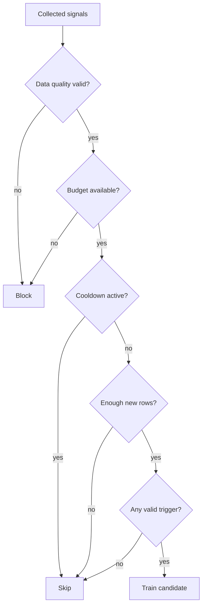

# Retraining Policy

## Purpose

Automated retraining should respond to meaningful evidence without creating an
uncontrolled training loop.

This project separates four concerns:

1. refresh monitoring evidence;
2. collect normalized retraining signals;
3. decide whether a candidate may be trained;
4. independently decide whether that candidate may replace the champion.

Retraining therefore does not imply promotion, and promotion does not bypass
serving-release validation.

## Policy Actions

The policy returns exactly one of three actions:

| Action | Meaning |
|---|---|
| `block` | Retraining must not proceed because a hard safety or resource condition failed |
| `skip` | Retraining is currently unnecessary or temporarily suppressed |
| `train_candidate` | A new challenger may be trained and evaluated |

The result is represented by an immutable `RetrainingDecision` containing:

- the selected action;
- a stable decision ID;
- human-readable reasons;
- trigger types;
- the complete normalized evidence.

## Evidence Model

The policy consumes `RetrainingSignals` instead of reading files or external
systems directly.

Signals include:

- dataset version;
- number of new training rows;
- configured minimum training rows;
- validated Ground Truth batch identifiers;
- data-quality result;
- persistent performance-degradation result;
- persistent feature-drift result;
- cooldown status;
- retraining-budget availability;
- scheduled-refresh status;
- days since the latest completed training;
- latest performance and drift window timestamps;
- detailed evaluation reasons.

Keeping collection separate from policy evaluation makes decisions
deterministic and directly testable.

## Stable Decision Identity

Each decision receives an ID derived from the evidence that defines the
evaluated state:

- dataset version;
- performance-window end;
- drift-window end;
- number of new training rows;
- performance-degradation status;
- feature-drift status;
- batch IDs;
- scheduled-refresh status.

The normalized values are serialized deterministically and hashed with
SHA-256. The first 16 hexadecimal characters form an identifier such as:

```text
retrain-0123456789abcdef
```

Wall-clock timestamps and free-text reasons are deliberately excluded. The
same evidence therefore produces the same decision ID.

Before starting training, the retraining service checks whether that decision
completed previously. A repeated decision returns status `duplicate` instead
of launching the same lifecycle again.

## Decision Order

The checks run in a deliberate order:



The concrete precedence is:

1. block when Ground Truth data quality fails;
2. block when the configured retraining budget is unavailable;
3. skip while the cooldown is active;
4. skip when fewer than the minimum number of new rows are available;
5. train when a scheduled refresh is due;
6. train when forecast degradation is persistent;
7. train when feature drift is persistent;
8. otherwise skip.

Multiple trigger types can be attached to the same candidate run.

## Ground-Truth Validation and Deduplication

The signal collector reads files matching:

```text
data/raw/new_batches/ground_truth_*.csv
```

Every batch is validated with the normal training-data validation rules.

A content-based batch ID is calculated from the raw file bytes:

```text
gt-<first-20-characters-of-sha256>
```

Previously processed batch IDs are stored in the retraining state. Rows count
as new training data only when their batch ID was not recorded by a previous
successful retraining lifecycle.

The dataset version is derived from the sorted set of available batch IDs.
Renaming a file without changing its contents therefore does not create a new
training batch.

If any batch fails validation, data quality is marked invalid and the policy
returns `block`.

## Minimum and Maximum Training Data

The development policy requires at least:

```text
500 new validated rows
```

Insufficient data returns `skip`, even when drift or degraded performance is
present. This prevents small Ground Truth batches from launching unstable
training runs.

The configured upper safety limit is:

```text
1,000,000 new rows
```

This limit acts as a simple local retraining-budget guard. Larger unexpected
batches must be reviewed instead of automatically consuming unbounded
resources.

## Cooldown

After a successful candidate-training lifecycle, the retraining timestamp is
persisted. The development configuration applies a cooldown of:

```text
168 hours
```

Any otherwise valid trigger encountered during this period returns `skip`.

Cooldown is based on the latest completed candidate training, including a
candidate that was evaluated but not promoted. This prevents repeated
expensive training merely because the champion remained unchanged.

## Scheduled Refresh

A scheduled refresh becomes due when the elapsed time since the latest
completed training reaches:

```text
168 hours
```

The collector first checks the persisted retraining state. During initial
bootstrap, it can fall back to the creation time of the active serving
release.

A missing, invalid or future-dated timestamp does not force retraining.

Scheduled refresh is a valid trigger only after:

- data quality succeeds;
- budget is available;
- cooldown is inactive;
- sufficient new training rows exist.

## Persisted Retraining State

Successful candidate training writes:

```text
data/monitoring/retraining_state.json
```

The state contains:

- schema version;
- last decision ID;
- latest retraining timestamp;
- selected action;
- trigger types and reasons;
- dataset version;
- evaluated monitoring-window timestamps;
- candidate MLflow run ID;
- promotion result;
- processed Ground Truth batch IDs.

State is written only after the training lifecycle completes successfully.
Blocked, skipped, duplicate or failed runs do not incorrectly mark batches as
processed.

## Automated Execution

The Prefect deployment is configured in `prefect.yaml` as:

| Setting | Value |
|---|---|
| Deployment | `mlops-sales-forecasting-auto-retraining/auto-retraining` |
| Schedule | `0 3 * * *` |
| Time zone | `Europe/Berlin` |
| Work pool | `local-process-pool` |
| Work queue | `default` |

The deployment evaluates the policy daily at 03:00 local time. This does not
mean a model is trained every day. Most evaluations are expected to return
`skip`.

Each cycle performs:

1. rebuild monitoring evidence;
2. collect normalized signals;
3. evaluate the retraining policy;
4. return immediately for `block` or `skip`;
5. reject an already processed decision as `duplicate`;
6. build the normal Rossmann training pipeline;
7. run the tracked Prefect model lifecycle;
8. persist the candidate run and promotion result.

Possible service-level statuses are:

- `blocked`;
- `skipped`;
- `duplicate`;
- `retrained`.

## Retraining and Promotion Are Independent

`train_candidate` authorizes model training, not champion replacement.

Every candidate proceeds through the normal MLflow tracking and promotion
policy. Promotion requires:

- at least 1,000 validation rows;
- at least 100 rows in each required segment;
- at least 0.5% relative RMSE improvement;
- no required segment with more than 2% RMSE regression;
- no increase in absolute bias greater than 100;
- successful serving-release construction and validation.

The required evaluation segments are:

- promotion rows;
- non-promotion rows.

A rejected challenger remains recorded in MLflow but does not modify the
active serving-release pointer.

## Design Limitations

The current budget guard uses a configured row-count ceiling rather than a
cloud billing or quota API.

Scheduled refresh still requires enough new Ground Truth. It is not a forced
blind retraining mechanism.

Thresholds are project configuration, not universally valid forecasting
standards. They must be recalibrated for different datasets, business costs
and traffic patterns.

Automated retraining relies on delayed labels. Without representative Ground
Truth, performance-based decisions cannot be evaluated reliably.

## Related Documentation

- [System architecture](architecture.md)
- [Local development](local-development.md)
- [Monitoring, SLOs and alerting](monitoring-and-slos.md)
- [Serving releases](serving-releases.md)
- [Operations runbook](operations-runbook.md)
