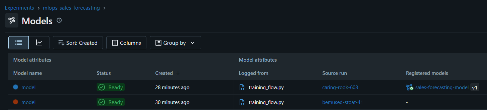
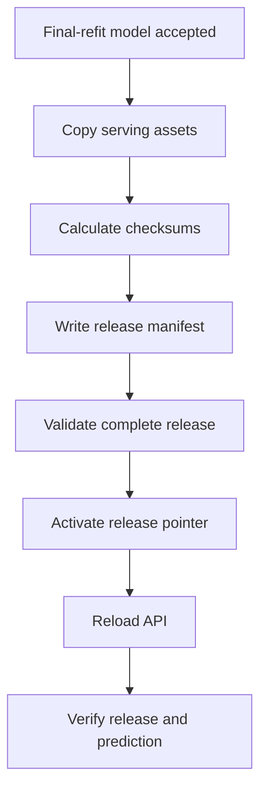

# Serving Releases

## Why a Serving Release Exists

A forecasting model depends on more than model weights. Correct predictions
also require matching metadata, historical feature state, calendar information
and preprocessing assumptions.

Loading these assets independently can create a mixed serving state. A serving
release therefore packages references and assets that must be activated as one
unit.

MLflow and the serving-release repository have separate responsibilities.
MLflow stores training lineage and registered model versions, backed by
persistent Cloud SQL metadata and GCS model artifacts. The serving-release
repository binds one exact MLflow model version to the matching forecasting
state, store metadata, calendar and semantic prediction probe.

## Release Contents

A release directory contains:

| Object | Purpose |
|---|---|
| `serving_manifest.json` | Release identity, model metadata and artifact references |
| `store.parquet` | Store-level metadata required for features |
| `latest_state.json` | Latest lag and rolling state per store |
| `known_calendar.parquet` | Known holiday and calendar information |
| `prediction_probe.json` | Semantic post-deployment request |

<p align="center">
  
</p>

<p align="center">
  <em>Immutable GCS release containing the serving manifest, feature state, store metadata, calendar data and semantic prediction probe.</em>
</p>

The manifest also records:

- release creation time;
- exact model name, numeric version and run ID;
- immutable model URI;
- model type and target transformation;
- dataset version;
- configuration hash;
- Git commit;
- artifact checksums.

## Implementation Ownership

The release lifecycle is split into focused modules:

| Module | Responsibility |
|---|---|
| `src/inference/releases/manifest.py` | Release manifest and artifact-reference models |
| `src/inference/releases/storage.py` | Release paths and storage operations |
| `src/inference/releases/repository.py` | Loading manifests, releases and the active pointer |
| `src/inference/releases/publisher.py` | Publishing and activating complete releases |
| `src/inference/model_manager.py` | Loading the model and release assets into a validated bundle |
| `src/api/serving_state.py` | Atomically replacing the active process-local bundle |
| `flows/deployment_flow.py` | Reload, verification and rollback orchestration |

### Model artifact lineage

Candidate evaluation and production refitting produce separate MLflow model
artifacts. The candidate is used for the fair validation comparison. Only an
accepted candidate is refitted on the combined training and validation data
and registered for production serving.

MLflow stores experiment, run, registered-model, model-version and alias
metadata in the persistent PostgreSQL backend. In the Google Cloud deployment,
this backend is provided by Cloud SQL. The corresponding model artifacts are
stored in GCS.

A serving manifest records the exact numeric model version and run ID selected
for the release. Runtime loading therefore does not depend on the mutable
`champion` alias after the release has been published.

<p align="center">
  
</p>

<p align="center">
  <em>
    MLflow model artifacts for the candidate and final-refit runs.
    Only the accepted final-refit model is linked to the registered
    production model version.
  </em>
</p>


## Publication Flow



Publication writes and validates the full release before changing the active
pointer. Failed publication must leave the previous pointer unchanged.

## Atomic API Reload

The API reload process follows a load-before-swap pattern:

1. Resolve the active release ID.
2. Load the manifest.
3. Validate referenced paths and checksums.
4. Load the exact MLflow model version.
5. Load metadata, state and calendar assets.
6. Validate the complete candidate bundle.
7. Replace the active in-memory bundle in one step.

Health, readiness, metrics and prediction endpoints do not keep separate bundle
copies. They all resolve the active process-local reference through
`src.api.serving_state`.

An exception before step 7 leaves the previous serving bundle active.

## Path and Checksum Protection

Artifact references must be relative and remain below the release root. Paths
such as `../../secret.txt` are rejected. Every release artifact is verified
against the SHA-256 checksum stored in the manifest.

These controls protect against accidental path traversal, incomplete uploads
and modified state files.

## Semantic Prediction Probe

The release includes a request representative of real API inference. The probe
validates more than HTTP availability: it exercises schema validation, feature
construction, model execution and target postprocessing.

A successful probe requires:

- HTTP 200;
- the expected release ID;
- the expected model version and run ID;
- the expected number of predictions;
- numeric, finite and non-negative results.

Probe requests contain a context marker such as
`post_deployment_verification`. They are excluded from normal prediction logs
so operational checks do not contaminate performance monitoring.

## Rollback

The deployment task records the previously active release before activating a
new one. If reload or verification fails:

1. restore the previous release pointer;
2. reload the API;
3. verify that the previous release is ready again;
4. report the failed deployment as rolled back.

Rollback changes the release pointer; it does not rebuild the container or
mutate the old release.

## Release Operations

List releases through the project Make target:

```bash
make list-serving-releases
```

Inspect current readiness:

```bash
curl -fsS http://localhost:8000/readyz | jq .
```

Verify normal inference after any manual rollback:

```bash
make predict-test
```

Use only release IDs returned by the release-listing command. The activation
function rejects missing releases or releases without a manifest.

## Immutability Rules

- Never edit a published release in place.
- Never reuse a release ID.
- Publish corrected assets as a new release.
- Keep the active pointer small and replace it atomically.
- Use numeric model versions rather than a mutable alias in the final model URI.
- Retain enough historical releases to support operational rollback.

## Test Coverage

Unit and integration tests verify:

- publication and active-manifest loading;
- checksum failure after artifact modification;
- failed publication preserving the active release;
- path containment;
- pointer activation and missing-release rejection;
- API reload preserving the previous bundle on failure;
- prediction-probe success and semantic failures;
- rollback after deployment-verification failure.

## Related Documentation

- [Architecture](architecture.md)
- [Production demo](production-demo.md)
- [Monitoring and SLOs](monitoring-and-slos.md)

