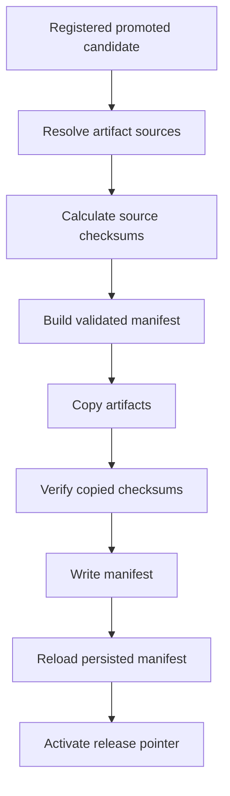

# Serving Releases

## Purpose

An MLflow model version alone is not sufficient to serve a stateful sales
forecast.

Inference also requires the exact store metadata, forecasting state, known
calendar and target transformation that belong to that model. A serving
release groups these dependencies into one immutable, validated unit.

This prevents combinations such as:

- a new model with an old feature state;
- a model trained against different store metadata;
- a calendar that does not cover requested forecast dates;
- a mismatched target transformation;
- partially copied or modified artifacts.

## Release Contents

A forecasting serving release contains:

| Component | Release path or reference |
|---|---|
| Registered XGBoost model | Immutable MLflow model URI |
| Store metadata | `store_metadata.parquet` |
| Forecasting state | `store_state.json` |
| Known calendar | `known_calendar.parquet` |
| Release metadata | `manifest.json` |

The required source artifacts are taken from:

| Artifact | Source |
|---|---|
| Store metadata | `paths.validated_data/store.parquet` |
| Forecasting state | `paths.models/latest_state.json` |
| Known calendar | `paths.features/known_calendar.parquet` |

The manifest also records:

- schema version;
- release ID;
- timezone-aware creation timestamp;
- task type;
- model name and version;
- MLflow run ID and immutable model URI;
- model implementation type;
- relative artifact paths and SHA-256 checksums;
- dataset version when available;
- configuration hash when available;
- Git commit when available;
- target transformation;
- evaluation metrics.

## Storage Layout

Local development uses a structure equivalent to:

```text
artifacts/models/
├── active_serving_release.json
├── latest_state.json
└── serving_releases/
    └── release-<uuid>/
        ├── manifest.json
        ├── store_metadata.parquet
        ├── store_state.json
        └── known_calendar.parquet
```

The same logical layout can be stored in a configured Cloud Storage path.

Release IDs must satisfy the storage validation rules and are generated as
unique values beginning with `release-`.

## Manifest Validation

All manifests must satisfy the shared release contract:

- supported schema version;
- non-empty release ID;
- valid timezone-aware creation timestamp;
- supported task type;
- complete registered-model reference;
- at least one artifact;
- non-empty artifact names;
- relative artifact paths;
- valid 64-character SHA-256 checksums;
- mapping-shaped optional metadata.

Artifact paths must not:

- be absolute;
- use a separate `gs://` URI;
- contain parent-directory traversal through `..`.

The forecasting policy additionally requires:

- task type `forecasting`;
- artifact `store_metadata`;
- artifact `store_state`;
- artifact `known_calendar`;
- a non-empty `target_transformation`.

## Publication Preconditions

A release can be built only when:

1. the candidate was registered successfully;
2. a concrete model version and immutable model URI exist;
3. the promotion policy approved the candidate;
4. the `champion` alias assignment exists;
5. the alias refers to the same model name and version as the registration;
6. all required forecasting artifacts exist.

A rejected challenger is retained in MLflow but does not produce an active
serving release.

## Publication Flow

Release publication follows this sequence:


```mermaid
flowchart TD
    A[Registered promoted candidate] --> B[Resolve artifact sources]
    B --> C[Calculate source checksums]
    C --> D[Build validated manifest]
    D --> E[Copy artifacts]
    E --> F[Verify copied checksums]
    F --> G[Write manifest]
    G --> H[Reload persisted manifest]
    H --> I[Activate release pointer]
```

Checksums are calculated before copying. After publication, the resulting
artifact references must exactly match the original references. This detects
source changes occurring during publication.

The persisted manifest is loaded and validated again before activation.

If copying, manifest writing or validation fails, the publisher performs a
best-effort cleanup of the incomplete release. The active pointer is not
changed.

## Immutability

A published release directory must be treated as immutable.

Corrections require a new release ID. Existing artifacts and manifests must
not be edited in place because doing so would invalidate:

- artifact checksums;
- reproducibility;
- rollback confidence;
- audit history;
- the relationship between model and inference state.

## Active Release Pointer

The active model is selected through:

```text
artifacts/models/active_serving_release.json
```

The pointer contains:

- schema version;
- active release ID;
- previous release ID when available;
- operation type;
- timezone-aware update timestamp.

Supported operations are:

- `bootstrap` for the first release;
- `activation` for a newer accepted release;
- `rollback` for returning to the previous release.

The pointer is updated only after the target release manifest has been loaded
and validated. The stored pointer is read back and compared with the intended
value before activation is considered successful.

## Bundle Loading

The bundle loader resolves the active pointer and loads:

- the native XGBoost model;
- store metadata;
- forecasting state;
- known calendar;
- target transformation;
- manifest and model lineage.

The assembled `ServingBundle` is accepted only when:

- release and manifest IDs match;
- the task type is forecasting;
- the model is available;
- the serving alias is non-empty;
- target transformation matches the manifest;
- store metadata and known calendar are non-empty data frames;
- forecasting state is a non-empty mapping.

If any validation fails, the bundle is rejected.

## Atomic Reload

`ModelManager` owns the active in-process bundle.

During reload it:

1. retains the current working bundle;
2. loads and validates a candidate bundle;
3. replaces the active reference only after validation succeeds;
4. preserves the previous bundle when loading fails;
5. records the latest reload error;
6. updates the serving-readiness metric.

This prevents requests from observing partially loaded model state.

Trigger a reload through the authenticated endpoint:

```bash
curl \
  --fail \
  --request POST \
  --header "X-API-Key: ${API_KEY}" \
  http://localhost:8000/admin/reload
```

## Readiness

`GET /livez` reports whether the API process is running.

`GET /readyz` reports whether a complete serving bundle is loaded. The API can
therefore be live while returning HTTP `503` for readiness when:

- no active pointer exists;
- the manifest is invalid;
- a required artifact is missing;
- checksum verification fails;
- the model cannot be loaded;
- task-specific bundle validation fails.

Predictions remain unavailable until readiness succeeds.

## Rollback

Rollback reads `previous_release_id` from the current pointer, validates that
release and activates it with operation `rollback`.

The release being replaced becomes the new previous release. This preserves a
traceable transition and allows controlled forward or backward movement
between existing immutable releases.

Rollback fails safely when:

- no previous release is recorded;
- the referenced manifest is missing;
- the release task type is incompatible;
- release validation fails.

A Cloud Run rollback and a model-release rollback are independent operations.
Application revision problems should not be repaired by promoting another
model, and model-state problems do not necessarily require an application
rollback.

## Operational Rules

- Never edit a published release.
- Never point serving to an incomplete directory.
- Never activate a release solely because its model exists in MLflow.
- Never bypass promotion policy during normal lifecycle execution.
- Preserve previous releases required for rollback.
- Verify `/readyz` and one representative prediction after activation.
- Investigate the recorded reload error before replacing a working bundle.

Detailed incident procedures are maintained in the
[operations runbook](operations-runbook.md).

## Related Documentation

- [System architecture](architecture.md)
- [Local development](local-development.md)
- [Monitoring, SLOs and alerting](monitoring-and-slos.md)
- [Retraining policy](retraining-policy.md)
- [Operations runbook](operations-runbook.md)
