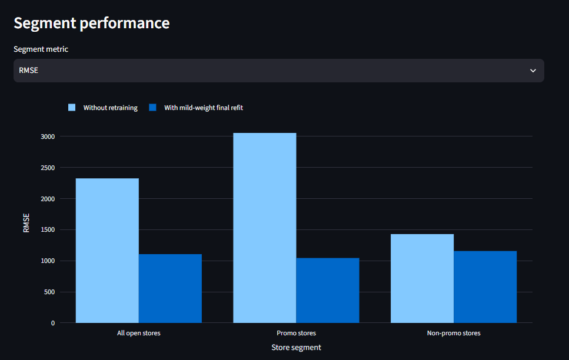

# Lifecycle simulation reference results

This directory contains small, versioned reference results from the controlled
Rossmann lifecycle simulation.

The large Rossmann source datasets, generated results and simulation runtime
are not stored in Git.

## Reference scenario

The scenario introduces gradual promotional drift:

- drift starts on simulation day 20;
- drift increases over 14 days;
- non-promotional sales remain unchanged;
- promotional sales are reduced by up to 25 percent.

Two otherwise matching lifecycles are compared:

1. the initial champion remains active without retraining;
2. monitoring signals may trigger challenger training and controlled
   promotion.

Retraining and promotion are separate events. Three challengers are trained
in the reference lifecycle, but only the final challenger passes evaluation
and replaces the active champion.

## Reference files

- `without_retraining.csv`: lifecycle under gradual promotional drift without
  executing retraining;
- `with_retraining.csv`: the same lifecycle with automated retraining enabled;
- `segment_metrics.csv`: final comparison for all open stores, promotional
  stores and non-promotional stores.

The checked-in results show an approximate final-RMSE improvement from
`2487.88` to `1065.79`, corresponding to about `57.2%`.

## Prerequisites

Local input data is expected at:

```text
data/raw/train.csv
data/raw/store.csv
data/simulation/simulation_ground_truth.csv
```

The simulation also requires:

- a running MLflow tracking server;
- an initial champion model;
- an active serving-release pointer;
- a running Prefect server for retraining-enabled runs.

Start the local services:

```bash
make mlflow-up
make prefect-up

export PREFECT_API_URL=http://127.0.0.1:4200/api
```

## Reproducing a run

Run a short smoke test:

```bash
uv run python \
  scripts/run_lifecycle_simulation.py \
  --config dev.yaml \
  --retraining disabled \
  --maximum-days 1 \
  --output examples/lifecycle_simulation/generated/smoke-test.csv
```

Run the complete baseline:

```bash
uv run python \
  scripts/run_lifecycle_simulation.py \
  --config dev.yaml \
  --retraining disabled
```

Run the lifecycle with automated retraining:

```bash
uv run python \
  scripts/run_lifecycle_simulation.py \
  --config dev.yaml \
  --retraining enabled
```

Each invocation resets `data/simulation/runtime/` unless `--keep-runtime` is
specified. This workspace isolates mutable raw batches, monitoring files,
feature state, model artifacts and serving-release pointers from the normal
development environment.

Generated runs are written below `generated/` and are intentionally ignored
by Git. The versioned CSV files in this directory remain stable portfolio
references and are not overwritten automatically.

## Dashboard

Start the Streamlit dashboard:

```bash
make dashboard-up
```

Open `http://localhost:8501` and select **Lifecycle Simulation**.

Purple diamonds mark retraining events. The orange star marks the challenger
that passed evaluation and was promoted to champion.

<p align="center">
  
</p>

<p align="center">
  <em>
    Segment-level RMSE shows that the promoted final refit improves the
    forecast particularly strongly for stores affected by the simulated
    promotional drift.
  </em>
</p>

